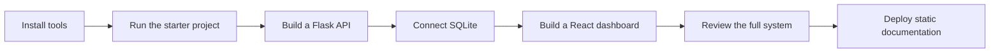

# Tutorial 1: FinSight Risk Dashboard

This is one tutorial in **SWS3022 AI/ML for Financial Services**. In this tutorial, you will build **FinSight Risk Dashboard**, a small full-stack web application for reviewing simple financial risk records.

The system uses four core technologies:

- **Flask** for the backend API.
- **SQLite** for persistent data.
- **React** for the user interface.
- **Node.js and npm** for frontend development and builds.

The goal is not only to copy commands. The goal is to understand how the parts of a web system cooperate.

## Learning Goals

By the end of this tutorial, you should be able to:

- Explain what the browser, frontend, backend, and database each do.
- Run a Flask API and a React app locally.
- Read and write data through HTTP requests.
- Store application data in SQLite.
- Review a small system by tracing data from the UI to the database and back.
- Understand what GitHub Pages can and cannot host.
- Connect software architecture ideas to a financial-services workflow.

## Course Map

## Important Hosting Note

GitHub Pages hosts static files. It is a good place for this tutorial website and for a built React frontend. It does not run a Flask server or a SQLite database process.

For the course project, students will first run the complete system locally. Later deployment lessons will separate the static frontend from the backend service.

## First Checkpoint

Before starting the technical lessons, make sure you can describe this sentence in your own words:

> A React frontend sends HTTP requests to a Flask backend, and the Flask backend uses SQLite to store and retrieve data.

## Review Questions

1. What part of the system does the browser run?
2. Why do we need a backend if React can already show a page?
3. Why is GitHub Pages a good place for course documentation?
