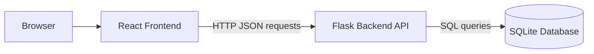
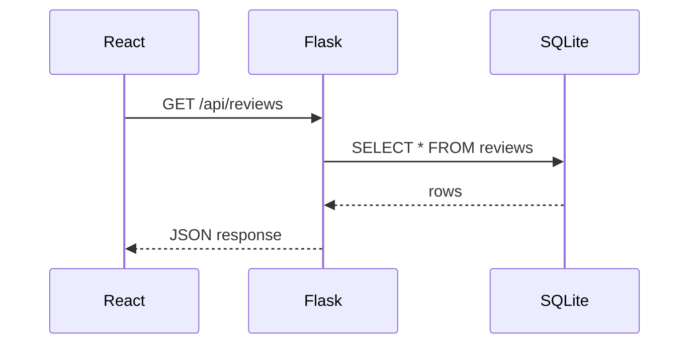

# System Architecture

A web system is a group of parts that communicate through clear boundaries. In this tutorial, the most important boundary is the **HTTP API** between React and Flask.

[HTTP](https://developer.mozilla.org/en-US/docs/Web/HTTP/Guides/Overview) is the request-response protocol used by browsers and servers. In simple terms: the browser or frontend asks for something, and the backend answers.

The architecture is simple, but it is worth studying carefully. Most beginner full-stack bugs come from confusing four things:

- Where the code is written.
- Which process is currently running.
- Which part owns the data.
- Which direction a request travels.

## Big Picture



Read the diagram from left to right. The browser does not jump directly to the database. React calls Flask. Flask queries SQLite. Flask returns data. React updates the screen.

## What Each Part Does

| Part | Main responsibility | Runs where |
| --- | --- | --- |
| Browser | Displays the page and runs JavaScript | User computer |
| React | Builds the interactive user interface | Browser |
| Node.js and npm | Install packages and run frontend tools | Developer computer |
| Flask | Receives API requests and applies application rules | Developer computer or backend server |
| SQLite | Stores application data in a database file | Same machine as Flask |

## Four Ideas to Keep Separate

### 1. Code location

Code location means where the file lives in the project folder.

```text
finsight-risk-dashboard/
  backend/      Python and Flask files
  frontend/     React and JavaScript files
```

This is about organization. A file existing in a folder does not mean it is currently running.

### 2. Runtime process

A runtime process is a program currently running on your machine.

In this tutorial, you will usually run two processes:

```text
Terminal 1: Flask backend
Terminal 2: React development server
```

If one process stops, that part of the system is down even if the files still exist.

### 3. Data ownership

Data ownership means which part is responsible for the reliable copy of the data.

| Data | Owner |
| --- | --- |
| Form input before clicking Save | React |
| Validated review record | Flask |
| Stored review record | SQLite |
| Displayed table rows | React |

React can show data, but SQLite stores data. Flask controls the path between them.

### 4. Communication path

Communication path means the route a message follows.

```text
React -> Flask -> SQLite
```

There is no direct path:

```text
React -> SQLite
```

That missing arrow is a design decision. It keeps database details out of the browser and keeps validation rules in the backend.

## Node.js Is Not the Backend Here

Node.js is important in this tutorial, but it is not our backend server.

We use Node.js to:

- Install React packages with `npm`.
- Run the React development server.
- Build static frontend files for deployment.

Flask is the backend because it owns the API routes and talks to SQLite.

## Request and Response

When React needs risk review data, it does not read the database directly. Instead, it asks Flask.



**JSON** is a text format commonly used for web data. In this project, Flask returns review records as JSON, and React reads that JSON to update the screen.

## A Request Is a Question

Think of an API request as a structured question:

| Request | Plain English meaning |
| --- | --- |
| `GET /api/reviews` | "Please give me the review records." |
| `POST /api/reviews` | "Please create this new review record." |

The response is the backend's answer. It should include data and a status code.

| Status code | Meaning in this tutorial |
| --- | --- |
| `200` | The request worked. |
| `201` | A new record was created. |
| `400` | The request data was not valid. |
| `404` | The route does not exist. |
| `500` | The backend crashed or hit an unexpected error. |

Status codes are not noise. They tell you which boundary to inspect.

## Example API Contract

An API contract is the agreement between frontend and backend. For `GET /api/reviews`, React expects JSON like this:

```json
[
  {
    "id": 1,
    "applicant_name": "Avery Tan",
    "product_type": "Personal Loan",
    "risk_band": "Medium",
    "model_score": 0.67,
    "review_date": "2026-09-18",
    "analyst_note": "Stable income, moderate utilization."
  }
]
```

The important idea is not the exact field names. The important idea is that React and Flask must agree on the shape of the data.

## Example: Creating One Record

When the analyst submits the form, React should send JSON like this:

```json
{
  "applicant_name": "Mira Lee",
  "product_type": "Credit Card",
  "risk_band": "Low",
  "model_score": 0.31,
  "review_date": "2026-09-19",
  "analyst_note": "Low utilization and clean repayment history."
}
```

Flask should validate the request before writing to SQLite. For example:

- `applicant_name` should not be empty.
- `model_score` should be a number.
- `risk_band` should use an expected label such as `Low`, `Medium`, or `High`.

This is architecture, not only coding style. The backend is the gatekeeper for stored data.

## Boundary Thinking

Use boundaries to debug. A boundary is a place where information crosses from one part of the system to another.

| Boundary | What to inspect |
| --- | --- |
| Browser to React | Does the button or form event run? |
| React to Flask | Does the Network tab show the request? |
| Flask route | Does the backend terminal show the request? |
| Flask to SQLite | Does the SQL query run without error? |
| SQLite to Flask | Did the query return rows? |
| Flask to React | Is the response JSON shaped correctly? |
| React to screen | Did React state update? |

When a feature fails, do not guess. Find the first boundary where the expected thing did not happen.

## Manual Trace Exercise

Trace `GET /api/reviews` by filling in the missing parts:

| Step | Question | Your answer |
| --- | --- | --- |
| 1 | Which user action starts the request? | |
| 2 | Which API route does React call? | |
| 3 | Which table does Flask query? | |
| 4 | What format does Flask return? | |
| 5 | Which part updates the screen? | |

Now repeat the same exercise for `POST /api/reviews`. The second trace is more important because it changes data.

## Common Confusions

!!! note "Frontend versus backend"
    The frontend is about user interaction. The backend is about system rules, data access, and API responses.

!!! note "Static hosting versus backend hosting"
    GitHub Pages can host HTML, CSS, JavaScript, images, and this tutorial website. It cannot run the Flask API.

!!! note "Seeing data versus saving data"
    If data appears on the page but disappears after refresh, React probably displayed it without SQLite storing it.

## Checkpoint

Trace this action:

> An analyst types a new risk review record into the form and clicks Save.

Use this answer format:

```text
React form -> POST /api/reviews -> Flask route -> SQLite insert -> JSON response -> React state update
```

Before continuing, explain the trace to another student without looking at the diagram. If you cannot explain it verbally, the architecture is not yet clear enough.

## Review Questions

1. Why should React not connect directly to SQLite?
2. What does Flask return to React?
3. What does Node.js do in this tutorial?
4. What is the difference between code location and runtime process?
5. Which boundary should you inspect if the backend returns `500`?
