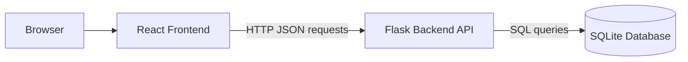
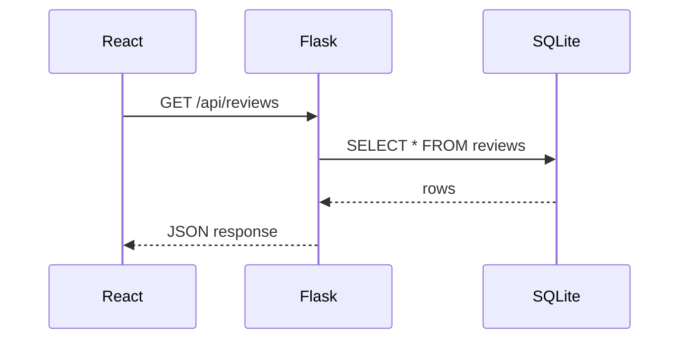

# System Architecture

A web system is a group of parts that communicate through clear boundaries. In this course, the most important boundary is the HTTP API between React and Flask.

## Big Picture



## What Each Part Does

| Part | Main responsibility | Runs where |
| --- | --- | --- |
| Browser | Displays the page and runs JavaScript | User computer |
| React | Builds the interactive user interface | Browser |
| Node.js and npm | Install packages and run frontend tools | Developer computer |
| Flask | Receives API requests and applies application rules | Developer computer or backend server |
| SQLite | Stores application data in a database file | Same machine as Flask |

## Node.js Is Not the Backend Here

Node.js is important in this course, but it is not our backend server.

In this tutorial, Node.js is used to:

- Install React packages with `npm`.
- Run the React development server.
- Build static frontend files for deployment.

Flask is our backend because it owns the API routes and talks to SQLite.

## Request and Response

When React needs risk review data, it does not read the database directly. Instead, it asks Flask.



This separation matters. The frontend should not know database details. The backend should protect data rules and provide a stable API.

## Example API Contract

The frontend will call this endpoint to load review records:

```text
GET /api/reviews
```

The backend will return JSON:

```json
[
  {
    "id": 1,
    "applicant_name": "Avery Tan",
    "product_type": "Personal Loan",
    "risk_band": "Medium",
    "model_score": 0.67,
    "review_date": "2026-09-18",
    "analyst_note": "Stable income, moderate utilization."
  }
]
```

The important idea is not the exact field names. The important idea is that React and Flask must agree on the shape of the data.

## Manual Trace Exercise

Trace this request by filling in the missing parts:

| Step | Question | Your answer |
| --- | --- | --- |
| 1 | Which user action starts the request? | |
| 2 | Which API route does React call? | |
| 3 | Which table does Flask query? | |
| 4 | What format does Flask return? | |
| 5 | Which part updates the screen? | |

## Common Confusions

!!! note "Frontend versus backend"
    The frontend is about user interaction. The backend is about system rules, data access, and API responses.

!!! note "Static hosting versus backend hosting"
    GitHub Pages can host HTML, CSS, JavaScript, images, and this tutorial website. It cannot run the Flask API.

## Checkpoint

Trace this action:

> An analyst types a new risk review record into the form and clicks Save.

You should be able to name the path from React to Flask to SQLite, and then back to React.

Checkpoint answer format:

```text
React form -> POST /api/reviews -> Flask route -> SQLite insert -> JSON response -> React state update
```

## Review Questions

1. Why should React not connect directly to SQLite?
2. What does Flask return to React?
3. What does Node.js do in this course?
