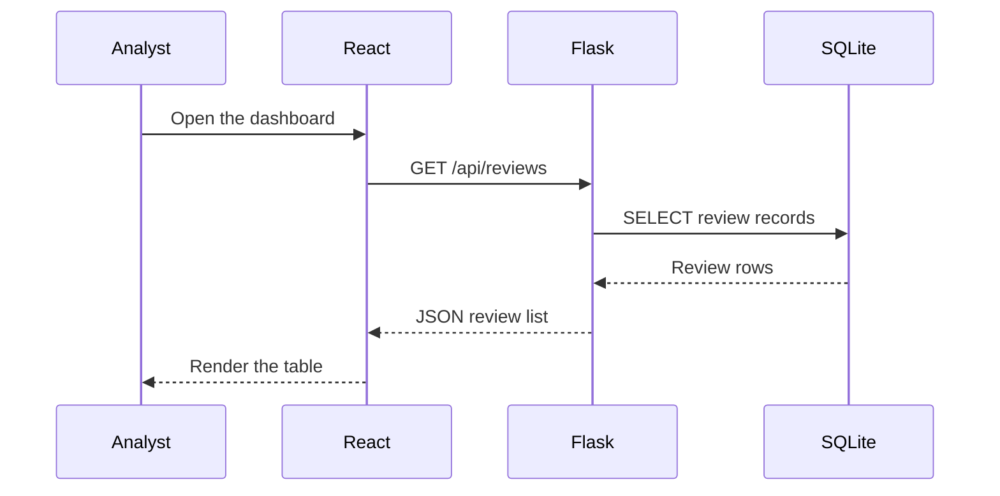

# What You Will Build

In this tutorial, you will build **FinSight Risk Dashboard**, a small application for recording and reviewing fictional financial risk assessments.

The application is not a production risk system. It is a learning system. Every field, route, and data movement should be inspectable by a student.

## Product Goal

FinSight Risk Dashboard lets a user:

- View a list of credit review records.
- Create a new review record.
- Filter records by risk band or product type.
- Inspect a simple model score and analyst note.

The first version will not include authentication, real customer data, payments, production model serving, or regulatory reporting. Those topics matter, but they would hide the architecture we need to learn first.

## User Story

Use this user story to keep the system focused:

> As an analyst, I want to record a simple risk review so that I can compare applicants by product type, model score, and risk band.

This is enough to require a real frontend, backend, and database.

## First Screen

The first screen should answer three questions:

1. What review records already exist?
2. Can I add a new review record?
3. Can I focus on records with a particular risk band?

Avoid adding charts or extra dashboards before this basic flow works. In software projects, adding features before the core path is stable usually makes debugging harder.

## Data Model

A data model describes the fields the system stores. Each review record has:

| Field | Example | Purpose |
| --- | --- | --- |
| `id` | `1` | Unique database identifier |
| `applicant_name` | `Avery Tan` | Fictional applicant name |
| `product_type` | `Personal Loan` | Financial product being reviewed |
| `risk_band` | `Medium` | Human-readable risk category |
| `model_score` | `0.67` | Simplified score from a model or rule |
| `review_date` | `2026-09-18` | Date of the review |
| `analyst_note` | `Stable income, moderate utilization.` | Short analyst context |

## Example Records

Use these fictional records when testing:

| Applicant | Product | Score | Risk band |
| --- | --- | --- | --- |
| Avery Tan | Personal Loan | `0.67` | Medium |
| Mira Lee | Credit Card | `0.31` | Low |
| Daniel Wong | SME Loan | `0.84` | High |

The exact values are not important. What matters is that each layer of the system agrees on the same fields.

## Data Ownership

One architecture rule:

> SQLite owns the stored records. React only displays a copy of records it received from Flask.

This distinction is important. If a value appears on the screen, that does not automatically mean it has been saved. It is saved only after Flask writes it to SQLite.

Use this mental model:

```text
React state = what the screen currently knows
SQLite row = what the system has stored
```

A correct application keeps these two views consistent.

## User Flow



## Small Implementation Plan

Build in this order:

1. Backend route that returns sample review records.
2. React screen that displays those records.
3. SQLite table that stores records.
4. Backend route that inserts a new record.
5. React form that sends the new record.
6. Filter control for `risk_band`.

This order lets you test one boundary at a time.

## Manual Design Task

Before writing code, sketch the first screen on paper or in a note:

1. A table or card list of review records.
2. A form for creating a review record.
3. A filter for `risk_band`.

Keep the sketch simple. The purpose is to decide what data the user needs to see.

## Checkpoint

You are ready to continue when you can answer:

- What information should a risk review record store?
- Which part displays review records?
- Which part saves review records?
- Which field would you filter first if you were an analyst?

## Review Questions

1. What features are included in the first version?
2. What features are intentionally excluded?
3. Why should the first version avoid real customer data?
4. What is the difference between React state and a SQLite row?
