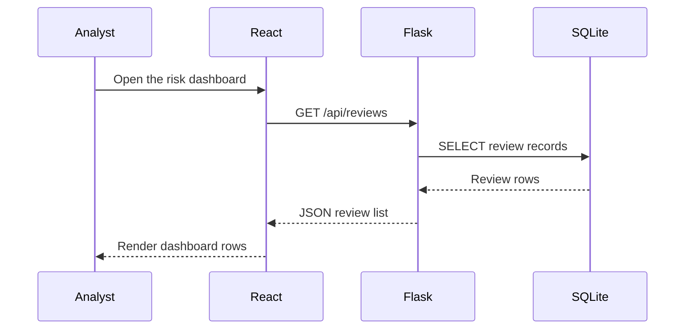

# What You Will Build

In this tutorial, you will build **FinSight Risk Dashboard**, a small full-stack web application for reviewing financial risk records.

The application is intentionally small, but it contains the same kinds of parts found in larger financial technology systems: user interface, API, data validation, database storage, and deployment decisions.

## Product Goal

FinSight Risk Dashboard lets a user:

- View a list of credit review records.
- Create a new review record.
- Filter records by risk band or product type.
- See a simple model score and analyst note.

The first version will not include accounts, passwords, payments, real customer data, or production model serving. Those features are important, but they would hide the core system ideas we want to learn first.

## Data Model

Each review record has:

| Field | Example | Purpose |
| --- | --- | --- |
| `id` | `1` | Unique database identifier |
| `applicant_name` | `Avery Tan` | Name used in the training example |
| `product_type` | `Personal Loan` | Financial product being reviewed |
| `risk_band` | `Medium` | Human-readable risk category |
| `model_score` | `0.67` | Simplified score from a model or rule |
| `review_date` | `2026-09-18` | Date of the review |
| `analyst_note` | `Stable income, moderate utilization.` | Short analyst context |

## User Flow

## Why This Project Works for Learning

This project is small enough to finish, but complete enough to teach real system thinking in a financial-services context.

- Flask teaches request handling and API design.
- SQLite teaches persistent storage without requiring a separate database server.
- React teaches component-based interfaces and state.
- Node.js teaches the modern frontend toolchain.
- GitHub teaches version control, collaboration, and deployment workflow.

## Checkpoint

You are ready to continue when you can answer:

- What information should a risk review record store?
- Which part of the system displays review records?
- Which part of the system saves review records?

## Review Questions

1. What features are included in the first version?
2. What features are intentionally excluded?
3. Why is a small but complete project better than a large unfinished project?
