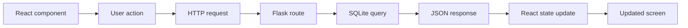

# Full System Review

A system review asks whether the parts work together clearly and reliably. It is not only a final check. It is a way to understand the system.

In this tutorial, review means tracing behavior across boundaries. Do not review only by looking at files. Review by following one user action through the running system.

## Review Path

Use this path whenever you need to understand a feature:



For example:

> A user creates a new risk review record.

Trace it as:

1. The user fills in a React form.
2. React sends a `POST /api/reviews` request.
3. Flask validates the request body.
4. Flask inserts a row into SQLite.
5. Flask returns the created review record as JSON.
6. React updates state and shows the new review record.

If you can trace this path accurately, you understand the main architecture of the project.

## API Contract

The API contract is the agreement between frontend and backend.

For `GET /api/reviews`, React expects:

```json
[
  {
    "id": 1,
    "applicant_name": "Avery Tan",
    "product_type": "Personal Loan",
    "risk_band": "Medium",
    "model_score": 0.67,
    "review_date": "2026-09-18",
    "analyst_note": "Stable income, moderate utilization."
  }
]
```

For `POST /api/reviews`, Flask expects:

```json
{
  "applicant_name": "Avery Tan",
  "product_type": "Personal Loan",
  "risk_band": "Medium",
  "model_score": 0.67,
  "review_date": "2026-09-18",
  "analyst_note": "Stable income, moderate utilization."
}
```

The frontend and backend must agree on this shape. If React sends `riskBand` but Flask expects `risk_band`, the system has a contract mismatch.

## Manual API Test

Use the browser Network tab first. If you are comfortable with the terminal, test the same route with `curl`:

```bash
curl http://127.0.0.1:5000/api/reviews
```

Expected result:

```json
[
  {
    "id": 1,
    "applicant_name": "Avery Tan",
    "product_type": "Personal Loan",
    "risk_band": "Medium",
    "model_score": 0.67,
    "review_date": "2026-09-18",
    "analyst_note": "Stable income, moderate utilization."
  }
]
```

The exact number of records may differ. The field names should match the contract.

## Architecture Review Questions

Ask these questions for every feature:

| Question | Why it matters |
| --- | --- |
| What starts the feature? | Identifies the user action or page load. |
| Which component sends the request? | Locates the frontend responsibility. |
| Which Flask route receives it? | Locates the backend responsibility. |
| Which table or query is involved? | Locates the database responsibility. |
| What JSON comes back? | Checks the API contract. |
| What changes on the screen? | Confirms the user-visible result. |

These questions are more useful than "does the code look right?" A system can look reasonable and still fail at a boundary.

## Review Checklist

- Can you run the backend from a clean terminal?
- Can you run the frontend from a clean terminal?
- Can you explain every API route?
- Can you find where each database field is created?
- Can you trace one user action from the browser to SQLite?
- Can you explain one error you fixed during development?

## Common Failure Modes

| Symptom | Likely area to inspect |
| --- | --- |
| Page is blank | Browser console and React code |
| API request fails | Network tab, Flask terminal, URL |
| Data disappears after restart | SQLite connection or insert logic |
| CORS error appears | Backend CORS configuration |
| Wrong fields appear | API contract mismatch |

## Debugging Scenario

Scenario:

> The React page loads, but the review table is empty.

Check in this order:

1. Browser console: look for JavaScript errors.
2. Network tab: confirm `GET /api/reviews` was sent.
3. Flask terminal: confirm the request reached the backend.
4. SQLite database: confirm at least one row exists.

Stop when you find the first broken link in the chain.

## Final Hands-On Check

Before considering the tutorial complete, demonstrate this sequence:

1. Start the backend from a clean terminal.
2. Start the frontend from a second clean terminal.
3. Open the dashboard.
4. Create a fictional review record.
5. Refresh the page.
6. Confirm the record is still present.
7. Open the Network tab and find the API request that loaded it.
8. Explain which part of the system stored the record.

This is the minimum evidence that the full stack is working.

## Final Reflection

A complete system is not a pile of files. It is a set of cooperating parts with clear responsibilities.

When you can explain the flow of data, you are no longer only using the code. You are reading the system.

## Review Questions

1. What is an API contract?
2. Where should you look first if the page is blank?
3. What does it mean to trace data through the system?
4. If the backend returns `500`, which terminal should you inspect first?
