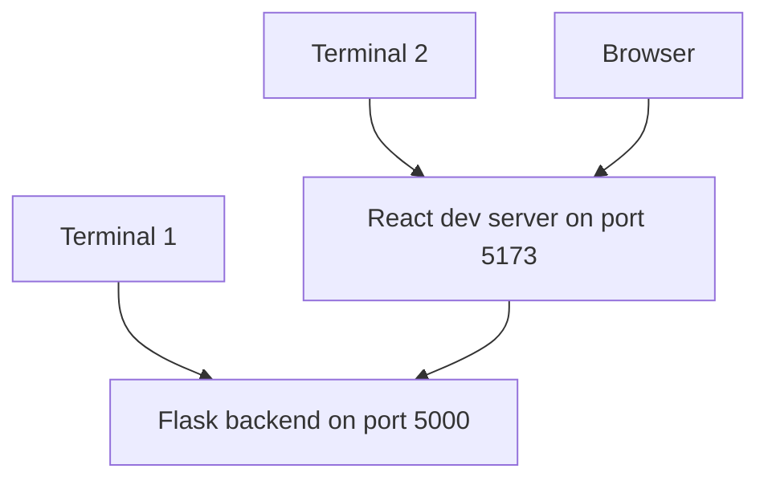

# Run the Starter Project

The starter project for FinSight Risk Dashboard will contain a backend folder and a frontend folder. This structure helps you see the boundary between the API and the user interface.

## Expected Project Structure

```text
finsight-risk-dashboard/
  backend/
    app.py
    requirements.txt
  frontend/
    package.json
    src/
  README.md
```

The backend and frontend are developed together, but they run as separate local processes.

## Why Two Processes?

The Flask backend and React frontend have different jobs:

- Flask handles API routes such as `GET /api/reviews`.
- React handles browser interaction and screen updates.
- During development, each tool runs its own local server.

## Start the Backend

From the `backend` folder:

```bash
python -m venv .venv
```

Activate the virtual environment.

On Windows PowerShell:

```powershell
.\.venv\Scripts\Activate.ps1
```

On macOS or Linux:

```bash
source .venv/bin/activate
```

Install backend dependencies:

```bash
python -m pip install -r requirements.txt
```

Run Flask:

```bash
python app.py
```

The backend should start on a local port such as `http://127.0.0.1:5000`.

## Backend Smoke Test

Before starting the frontend, test the backend directly in the browser:

```text
http://127.0.0.1:5000/api/health
```

Expected response:

```json
{
  "status": "ok"
}
```

If the starter project uses a different health route, use the route listed in its `README.md`.

## Start the Frontend

Open a second terminal. From the `frontend` folder:

```bash
npm install
npm run dev
```

The frontend should start on a local port such as `http://127.0.0.1:5173`.

## What Is Running



Two terminals are normal. One runs the backend. One runs the frontend.

## First Manual Test

Open the frontend in your browser. Then open the browser developer tools and check the Network tab.

When the page loads, you should see a request to the backend API, such as:

```text
GET /api/reviews
```

Click the request and inspect:

- Request URL
- Status code
- Response body

For a working starter project, the status code should usually be `200`.

## Mini Exercise

Add one fictional review record through the UI. Use this test data:

```text
Applicant: Avery Tan
Product: Personal Loan
Risk band: Medium
Model score: 0.67
Review date: 2026-09-18
Analyst note: Stable income, moderate utilization.
```

After saving, refresh the page. If the record is still visible, the database path is working.

## Checkpoint

You are ready to continue when:

- The backend terminal stays running.
- The frontend terminal stays running.
- The browser shows the starter page.
- The Network tab shows at least one API request.
- You can create one fictional review record and see it after refreshing.

## Review Questions

1. Why do the backend and frontend run in separate terminals?
2. What does the React development server do?
3. How can the browser Network tab help you debug?
