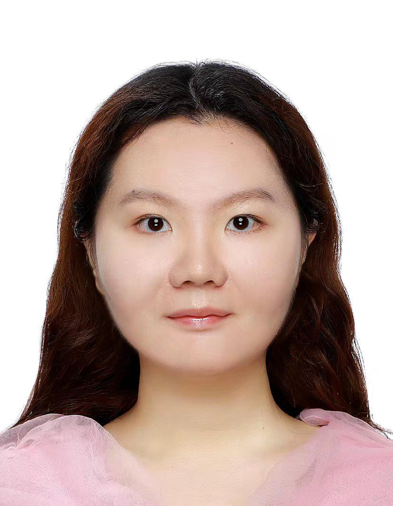

# Teaching Team

## Lecturer

### Anand BHOJAN

**[Department of Computer Science](https://www.comp.nus.edu.sg/cs/), [School of Computing](https://www.comp.nus.edu.sg/), NUS**

Dr. Anand Bhojan graduated with a Bachelor degree in Computing with Gold Medal (University topper) from Bharathiar University in 1994, Professional Masters in Computer Applications from Bharathidasan University in 1999, PGC in Teaching Higher Education from University of Sheffield, UK in 2003 and PhD from NUS in 2011.

He has received research achievement award and his thesis was nominated for best PhD thesis award. He is a member of the Communication and Internet Research Lab ([www.cir.nus.edu.sg](https://www.cir.nus.edu.sg/)) and Graduate studies committee.

He is the founder of Anuflora Systems ([www.anuflora.com](https://www.anuflora.com/)) and Virtual and Augmented Reality Labs ([www.varlabs.org](https://www.varlabs.org/)). He is also an Associate Editor of Computers and Electrical Engineering Journal, Elsevier as well as Vice President of International Researchers Club, Singapore.

Dr. Anand Bhojan has served as Organizing Chair and Program Chair of several international conferences, served in the Program Committees of several international conferences, and given keynote talks in IEEE/ACM international conferences.

## Tutor

### Jingyi ZHAN

**PhD Student and Digital Finance Researcher**

Jingyi Zhan is a PhD student in the Department of Information Systems and Analytics at School of Computing, National University of Singapore (NUS). She received her Bachelor's degree in Accounting from Jinan University and her Master's degree in Statistics from National University of Singapore.

Prior to her doctoral studies, she worked as a research associate at the Asian Institute of Digital Finance, where she conducted research on digital finance and developed statistical and machine learning models for financial applications. Her experience spans data analytics, predictive modeling, artificial intelligence, and digital financial technologies.

Her current research interests focus on artificial intelligence, platform governance, misinformation management, human-AI collaboration, and machine learning applications in financial technology. She is particularly interested in developing trustworthy and responsible AI systems that support effective decision-making and governance in digital platforms.

### Guoyi CHEN

**Full-Stack Software Engineer and AI/ML Researcher**

Guoyi Chen received his B.Eng. with Honours in Computer Engineering from the National University of Singapore in 2026, with a Second Major in Data Science and Analytics and a Specialization in Robotics, focusing on the Intelligent Robotics track.

He was a recipient of a full scholarship at NUS and is currently a Full-Stack Software Engineer and AI/ML researcher. His research interests focus on continual learning, continual machine learning, model adaptation, and reliable AI systems.

During his undergraduate studies, Guoyi served as a Teaching Assistant and Tutor for several NUS courses, including CG2111A Engineering Principles and Practice II, CG2271 Real-Time Operating Systems, and SWS3009 Deep Learning & Robotics. He also served as Co-Captain of the NUS Cross Country Team.

