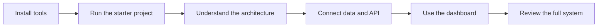

# Tutorial 1: FinSight Risk Dashboard

This is one tutorial in **SWS3022 AI/ML for Financial Services**. In this tutorial, you will build **FinSight Risk Dashboard**, a small full-stack web application for reviewing fictional financial risk records.

The project is deliberately modest. That is the point. A small system can still teach the ideas that matter in larger fintech systems: data flow, boundaries, validation, persistence, and debugging.

## Technologies Used

- [**React**](https://react.dev/learn): a JavaScript library for building user interfaces in the browser.
- [**Flask**](https://flask.palletsprojects.com/en/stable/): a Python framework for building backend web APIs.
- [**SQLite**](https://www.sqlite.org/docs.html): a lightweight database that stores data in a local file.
- [**Node.js and npm**](https://nodejs.org/learn/getting-started/introduction-to-nodejs): tools used to install and run the React development environment.
- [**GitHub Pages**](https://docs.github.com/en/pages/getting-started-with-github-pages/what-is-github-pages): a static hosting service. It can host this tutorial and a built React frontend, but it cannot run Flask or SQLite.

In this tutorial, Node.js is not the backend. Flask is the backend.

## What You Should Learn

By the end, you should be able to:

- Explain the difference between frontend, backend, database, and development tooling.
- Trace a user action from the browser to React, Flask, SQLite, and back.
- Read simple API requests and responses.
- Recognize whether a bug is likely in the frontend, backend, or database layer.
- Explain why React should not directly connect to SQLite.
- Build confidence working with a small fintech-style web application.

## Vocabulary We Will Use

| Term | Meaning in this tutorial |
| --- | --- |
| System | A group of parts that cooperate to perform a useful task. |
| Architecture | The structure of the system: parts, responsibilities, and communication paths. |
| Frontend | The browser-facing part of the app, built with React. |
| Backend | The server-side part of the app, built with Flask. |
| Database | The storage layer, built with SQLite. |
| API | A defined way for one part of the system to ask another part for data or work. |
| Contract | A shared expectation, such as the fields returned by an API route. |
| Persistence | Data remaining available after a page refresh or restart. |

These words are not decoration. They are tools for thinking clearly about the system.

## Tutorial Map



## Running Example

Use this fictional review record when testing:

```json
{
  "applicant_name": "Avery Tan",
  "product_type": "Personal Loan",
  "risk_band": "Medium",
  "model_score": 0.67,
  "review_date": "2026-09-18",
  "analyst_note": "Stable income, moderate utilization."
}
```

Do not use real personal, banking, trading, or customer data in this tutorial.

## First Checkpoint

Before continuing, write one sentence for each part:

| Part | Your explanation |
| --- | --- |
| React | |
| Flask | |
| SQLite | |
| Node.js/npm | |

Then draw the arrows. Your diagram should include this path:

```text
React -> Flask -> SQLite
```

It should not include this path:

```text
React -> SQLite
```

## Review Questions

1. Which part runs in the browser?
2. Which part stores data after a page refresh?
3. Which part owns the API routes?
4. Why is this tutorial built around a small project rather than a large application?
