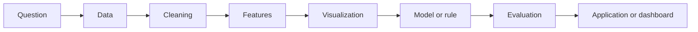

# Lecture 1 Supplement: From Python Tools to FinTech Projects

Lecture 1 is not a tour of isolated Python functions. It is the first step in a repeatable FinTech AI/ML workflow: ask a financial question, collect data, prepare it, create features, visualize patterns, test a model or rule, evaluate the result, and present the work clearly.

This supplement uses one continuous task to connect the tools:

> Analyze one stock using daily price data.

That task is simple enough to complete in a notebook, but rich enough to introduce the habits needed for larger projects.

## 1. Learning Outcomes

By the end of this supplement, you should be able to:

- Use Jupyter Notebook to run and document a simple financial data analysis.
- Explain why NumPy and Pandas are useful for financial datasets.
- Download and inspect stock price data using `yfinance`.
- Compute returns, moving averages, rolling volatility, and drawdown.
- Build and visualize Bollinger Bands.
- Explain the difference between a technical indicator and a trading strategy.
- Avoid common mistakes such as look-ahead bias and random train/test splitting for time series.
- Start designing a course project with a clear problem, dataset, baseline, model, metrics, and dashboard idea.

!!! note "Prerequisites"
    Students should have basic Python knowledge, including variables, lists, functions, and simple plotting. If you are new to Python, focus first on running the examples and explaining the outputs.

!!! note "Main idea"
    Python is not the goal. Pandas, NumPy, visualization, and ML models are tools. The goal is to turn financial data into decisions that are testable, explainable, and useful.

## 2. How to Use This Page

Use this page at different moments in the learning process.

| When | What to do |
| --- | --- |
| Before lecture | Skim the big picture, Jupyter essentials, and NumPy/Pandas essentials. |
| During lecture | Run the code examples and inspect the output after each block. |
| After lecture | Complete the hands-on lab from start to finish in one notebook. |
| Before project work | Review the project guide, proposal template, and common pitfalls. |

!!! tip "Work actively"
    Do not only copy the code. Change the ticker, the dates, or the rolling window and explain what changed.

## 3. The Big Picture

```text
Jupyter -> NumPy/Pandas -> Financial Data -> Visualization -> Features -> Models -> Project
```

This sequence is a learning map.

Jupyter gives you a place to experiment and explain your thinking. NumPy and Pandas give you the basic tools for numerical and tabular data. Financial data gives the analysis a real domain. Visualization helps you notice patterns and problems. Features convert raw observations into useful inputs. Models or rules test whether those inputs can support a decision. A project turns the analysis into something another person can inspect, question, and use.



!!! warning "Do not skip the middle"
    Many weak projects jump from data download directly to a complex model. A strong project explains the problem, checks the data, builds features, creates a baseline, and evaluates the result honestly.

## 4. Lecture 1 in One Practical Task

The running task is:

> Choose one stock, download daily price data, compute basic time series features, visualize Bollinger Bands, and discuss whether the signals are meaningful.

Although the running example uses stock data, the same workflow also applies to credit risk, fraud detection, portfolio analysis, robo-advisory, and many other FinTech problems.

Each tool has a role in this task.

| Tool or concept | Role in the task |
| --- | --- |
| Jupyter Notebook | Run the analysis step by step and document your interpretation. |
| Pandas | Store the stock data as a time-indexed table. |
| NumPy | Compute numerical transformations such as log returns. |
| Matplotlib | Plot prices, returns, bands, and signals. |
| Rolling windows | Create financial features from recent history. |
| Bollinger Bands | Turn rolling mean and volatility into an indicator. |
| Project thinking | Ask whether the analysis has a clear problem, baseline, evaluation, and presentation. |

The rest of this page builds toward that task.

## 5. Jupyter Notebook Essentials

Jupyter is useful because it combines code, output, charts, and written explanation. A good notebook should read like a short analysis report, not like a random scratchpad.

| Notebook element | Use it for |
| --- | --- |
| Code cell | Import packages, load data, calculate features, train models, or create plots. |
| Markdown cell | Explain the question, assumptions, observations, and limitations. |

### Run and Document Small Steps

```python
import math

math.sin(2)
```

This small example checks that Python code runs and returns output. In a real analysis, keep cells small enough that you can explain what each one does.

### Use Magic Commands for Timing

```python
%timeit [n ** 2 for n in range(1000)]
```

`%timeit` runs code repeatedly and reports timing information. This is useful when comparing slow loops with vectorized NumPy or Pandas operations.

### Use Shell Commands Carefully

```python
!pwd
!ls
```

These commands inspect your working folder on macOS or Linux. On Windows, use:

```python
!dir
```

Shell commands are useful for checking where the notebook is running and whether files are available.

### Use the Help System

```python
help(len)
```

```python
import pandas as pd

pd.DataFrame?
```

The help system reduces guessing. Use it when you are unsure about a function, argument, or object.

### Inspect Data Before Modeling

```python
df.shape
df.columns
df.dtypes
df.head()
```

These checks answer basic questions: how many rows exist, what columns are present, what data types are used, and what the first rows look like.

!!! warning "Before submitting a notebook"
    Restart the kernel and run all cells from top to bottom. If the notebook fails after a clean restart, it is not reproducible yet.

!!! warning "Common notebook mistakes"
    Running cells out of order, relying on old variables, forgetting to restart the kernel, using local file paths that teammates do not have, and leaving unexplained output are common causes of broken notebooks.

## 6. NumPy and Pandas Essentials

NumPy and Pandas help you work with data efficiently. In financial analysis, they are used for arrays, tables, dates, missing values, joins, and rolling calculations.

### Arrays and Vectorization

```python
import numpy as np

x = np.arange(10)
x[:5]
```

`np.arange(10)` creates an array of values from `0` to `9`. The slice `x[:5]` returns the first five values.

```python
big_array = np.random.randint(1, 100, size=1_000_000)
1.0 / big_array
```

This computes one million reciprocal values without writing a Python loop. Vectorized code is usually faster because the low-level array operation is optimized.

### Series and DataFrame

```python
import pandas as pd

prices = pd.Series([100, 102, 101], name="price")
prices
```

A `Series` is one labeled column of data.

```python
df = pd.DataFrame({
    "price": [100, 102, None, 105],
    "volume": [1000, 1200, 1100, None]
})

df
```

A `DataFrame` is a table with rows and columns. Most financial datasets you use in this course will become DataFrames.

### Indexing, Slicing, Views, and Copies

```python
x = np.arange(10)

x[0]
x[2:6]
x[-1]
```

Indexing selects one value. Slicing selects a range. When modifying sliced data, be careful: some operations return views, while others return copies.

```python
subset = x[:5].copy()
subset[0] = 999
```

!!! warning "Views and copies"
    If you plan to modify a subset, use `.copy()` when you need an independent object. This avoids accidental changes to the original data.

### Missing Data

```python
df.isnull()
```

This checks where values are missing.

```python
df.ffill()
```

Forward filling uses the previous available value.

!!! warning "Missing data is a financial decision"
    Filling missing values can change returns, volatility, and model inputs. Explain why your method is reasonable for the dataset and task.

### Merge and Concat

Use concatenation to stack similar tables.

```python
first = pd.DataFrame({"ticker": ["AAPL"], "price": [180]})
second = pd.DataFrame({"ticker": ["MSFT"], "price": [420]})

pd.concat([first, second], ignore_index=True)
```

Use merge to join related tables by a key.

```python
prices = pd.DataFrame({
    "ticker": ["AAPL", "MSFT"],
    "price": [180, 420]
})

sectors = pd.DataFrame({
    "ticker": ["AAPL", "MSFT"],
    "sector": ["Technology", "Technology"]
})

prices.merge(sectors, on="ticker")
```

!!! question "Check your understanding"
    1. Why is vectorized code usually faster than a Python loop?
    2. What is the difference between a `Series` and a `DataFrame`?
    3. Why should we be careful when filling missing financial data?

## 7. Financial Time Series: From Price to Features

Financial time series data is ordered by time. That order matters. You should not treat dates as interchangeable rows, especially when evaluating forecasting or trading models.

### Step 1: Download Stock Data

If `yfinance` is not installed, run:

```bash
pip install yfinance
```

```python
import yfinance as yf
import numpy as np
import pandas as pd
import matplotlib.pyplot as plt

ticker = "AAPL"
df = yf.download(ticker, start="2020-01-01", end="2025-01-01")
```

This downloads daily stock data for Apple from Yahoo Finance.

!!! note "Data source"
    Yahoo Finance data is useful for learning and prototyping. Always document the ticker, date range, download date, columns used, and data limitations.

!!! note "Close and adjusted close"
    For learning purposes, this page uses `Close`. In more careful financial analysis, you may need to consider `Adj Close`, which adjusts for corporate actions such as splits and dividends.

!!! tip "If columns look different"
    If the downloaded DataFrame has multi-level columns, inspect `df.columns` first and adjust the column selection accordingly.

!!! question "Reflect"
    What financial question could you ask using daily stock price data?

### Step 2: Inspect Shape, Columns, Missing Values, and Date Range

```python
df.head()
```

```python
df.shape
```

```python
df.columns
```

```python
df.isnull().sum()
```

```python
df.index.min(), df.index.max()
```

Inspection tells you what columns exist, how many rows are available, whether values are missing, and whether the date range matches the analysis question.

!!! question "Reflect"
    Does the dataset contain the columns, dates, and non-missing values needed for your analysis?

### Step 3: Plot Closing Price

```python
plt.figure(figsize=(12, 5))
plt.plot(df.index, df["Close"], label="Close")
plt.title(f"{ticker} Closing Price")
plt.xlabel("Date")
plt.ylabel("Price")
plt.legend()
plt.show()
```

The closing price plot shows the level of the asset over time. It can reveal large trends, sharp drops, and unusual periods.

!!! question "Reflect"
    Does the chart show a stable pattern, a trend, or periods of sharp movement?

### Step 4: Compute Simple Returns and Log Returns

```python
df["Return"] = df["Close"].pct_change()
df["LogReturn"] = np.log(df["Close"] / df["Close"].shift(1))
df[["Close", "Return", "LogReturn"]].head()
```

Simple returns measure relative percentage change from one period to the next. Log returns are another common way to measure price changes in quantitative finance. Both are often more useful than raw prices because they make changes comparable across different price levels.

!!! question "Reflect"
    Why might returns be more useful than raw prices when comparing different stocks?

### Step 5: Compute Moving Average

```python
df["MA20"] = df["Close"].rolling(20).mean()

plt.figure(figsize=(12, 5))
plt.plot(df.index, df["Close"], label="Close")
plt.plot(df.index, df["MA20"], label="20-day moving average")
plt.legend()
plt.title(f"{ticker} Close and 20-day Moving Average")
plt.show()
```

A moving average smooths short-term fluctuations. It helps you see recent trend direction, but it also reacts with delay.

!!! question "Reflect"
    What information is lost when a moving average smooths the price series?

### Step 6: Compute Rolling Volatility

```python
df["Volatility20"] = df["Return"].rolling(20).std()

plt.figure(figsize=(12, 4))
plt.plot(df.index, df["Volatility20"], label="20-day rolling volatility")
plt.legend()
plt.title(f"{ticker} Rolling Volatility")
plt.show()
```

Rolling volatility measures how much recent returns vary. High rolling volatility means recent price changes have been more unstable.

!!! question "Reflect"
    What does high rolling volatility mean for an investor or risk manager?

### Step 7: Compute Drawdown

```python
cum_return = (1 + df["Return"]).cumprod()
running_max = cum_return.cummax()
df["Drawdown"] = cum_return / running_max - 1

plt.figure(figsize=(12, 4))
plt.plot(df.index, df["Drawdown"], label="Drawdown")
plt.legend()
plt.title(f"{ticker} Drawdown")
plt.show()
```

Drawdown measures decline from a previous cumulative peak. It is important because investors care not only about final return, but also about how painful the path was.

!!! question "Reflect"
    Why is drawdown important even when the final return is positive?

### Step 8: Split Train/Test Data by Date

```python
train = df[df.index < "2024-01-01"]
test = df[df.index >= "2024-01-01"]

train.shape, test.shape
```

For forecasting or trading evaluation, train on past data and test on later data.

!!! warning "Do not randomly shuffle financial time series"
    Random splitting can allow future market conditions to influence training. For forecasting and trading tasks, this usually creates unrealistic evaluation.

!!! question "Reflect"
    Why should time series data usually be split by date instead of randomly?

## 8. Bollinger Bands Mini Case Study

Bollinger Bands are volatility-based bands around a moving average. They are useful for learning because they combine rolling mean, rolling standard deviation, visualization, and signal design.

### What Bollinger Bands Are

```text
Middle Band = 20-day moving average
Upper Band = Middle Band + 2 x rolling standard deviation
Lower Band = Middle Band - 2 x rolling standard deviation
```

The middle band represents recent average price. The upper and lower bands widen when recent price variation increases and narrow when recent price variation decreases.

!!! note "Price bands versus return volatility"
    Standard Bollinger Bands calculate the rolling standard deviation on prices. This is different from rolling volatility, which is usually calculated on returns.

### Calculate the Bands

```python
window = 20

df["Middle"] = df["Close"].rolling(window).mean()
df["Std"] = df["Close"].rolling(window).std()
df["Upper"] = df["Middle"] + 2 * df["Std"]
df["Lower"] = df["Middle"] - 2 * df["Std"]
```

This code calculates the moving average and a volatility range around it.

### Visualize the Bands

```python
plt.figure(figsize=(12, 6))
plt.plot(df.index, df["Close"], label="Close")
plt.plot(df.index, df["Middle"], label="20-day MA")
plt.plot(df.index, df["Upper"], linestyle="--", label="Upper Band")
plt.plot(df.index, df["Lower"], linestyle="--", label="Lower Band")
plt.legend()
plt.title("Bollinger Bands")
plt.show()
```

The visualization helps you see whether price is close to the recent average or far from it.

### Generate Simple Signals

```python
df["Signal"] = 0
df.loc[df["Close"] < df["Lower"], "Signal"] = 1
df.loc[df["Close"] > df["Upper"], "Signal"] = -1
```

This simple signal labels prices below the lower band as `1` and prices above the upper band as `-1`. The labels are often described as buy and sell signals, but they are not automatically buy and sell decisions. They are only signals that need interpretation.

### Reversal and Breakout Interpretations

| Interpretation | Possible reading |
| --- | --- |
| Reversal | Price below the lower band may suggest oversold conditions; price above the upper band may suggest overbought conditions. |
| Breakout | Price breaking above the upper band may suggest upward momentum; price breaking below the lower band may suggest downward momentum. |

These interpretations can disagree. That is why an indicator is not the same as a complete strategy.

### Indicator vs Strategy

A technical indicator is a feature or signal derived from data. A trading strategy needs more than an indicator.

| Component | Needed for a strategy? | Why |
| --- | --- | --- |
| Indicator | Yes | Provides information or a signal. |
| Entry rules | Yes | Defines when to open a position. |
| Exit rules | Yes | Defines when to close a position. |
| Position sizing | Yes | Defines how much capital is used. |
| Transaction costs | Yes | Makes evaluation more realistic. |
| Risk management | Yes | Limits exposure and losses. |
| Evaluation | Yes | Tests whether the rules worked on unseen data. |

!!! warning "Indicator limitation"
    Bollinger Bands are not a magic trading strategy. They are a volatility-based indicator. A proper strategy still needs backtesting, risk management, transaction cost assumptions, and careful evaluation.

!!! question "Reflect"
    1. Does a price crossing the upper band always mean we should sell?
    2. How would transaction costs affect this strategy?
    3. What might happen if we change the rolling window from 20 to 50?

## 9. Hands-on Lab: From Stock Data to Trading Signals

Complete this lab in a new Jupyter notebook. The output should include code, charts, and short written answers.

!!! tip "Run this lab in Google Colab"
    A runnable Google Colab notebook is available for this lab. Students can use it if they do not want to set up Python locally or if they want a working starter notebook. They should open the notebook, run all cells once, then change the ticker, date range, or rolling window and observe how the results change.

    [Open the Lecture 1 Colab Notebook](https://colab.research.google.com/drive/1C2l3_AwkoI1DDH4tedJU4iBmYEu3_UHj?usp=sharing)

    [Download the notebook from GitHub](https://github.com/SWS3022/SWS3022.github.io/raw/main/notebooks/lecture1_stock_signals.ipynb)

    [Download the notebook from this site](../assets/notebooks/lecture1_stock_signals.ipynb)

    Recommended workflow:

    1. Open the notebook.
    2. Run all cells once.
    3. Change the ticker.
    4. Re-run the analysis.
    5. Answer the reflection questions in your own words.

### Step 1: Choose a Ticker

Choose one stock ticker available on Yahoo Finance.

```python
ticker = "AAPL"
```

Instruction: Replace `"AAPL"` with another ticker if you want to study a different stock.

### Step 2: Download 2024 Daily Data

If `yfinance` is not installed, run:

```bash
pip install yfinance
```

```python
import yfinance as yf
import numpy as np
import pandas as pd
import matplotlib.pyplot as plt

df = yf.download(ticker, start="2024-01-01", end="2025-01-01")
```

Instruction: Keep the 2024 date range so your results are easy to compare with classmates.

!!! note "Close and adjusted close"
    This lab uses `Close` for simplicity. In more careful financial analysis, you may need to consider `Adj Close`, which adjusts for corporate actions such as splits and dividends.

!!! tip "If columns look different"
    If the downloaded DataFrame has multi-level columns, inspect `df.columns` first and adjust the column selection accordingly.

### Step 3: Inspect the Dataset

```python
df.head()
```

```python
df.info()
```

```python
df.isnull().sum()
```

Instruction: Write one or two sentences describing the columns, date range, and missing values.

### Step 4: Plot Closing Price

```python
plt.figure(figsize=(12, 5))
plt.plot(df.index, df["Close"], label="Close")
plt.title(f"{ticker} Closing Price in 2024")
plt.xlabel("Date")
plt.ylabel("Price")
plt.legend()
plt.show()
```

Instruction: Describe whether the price mostly increased, decreased, or moved sideways during the year.

### Step 5: Compute Daily Returns

```python
df["Return"] = df["Close"].pct_change()

plt.figure(figsize=(12, 4))
plt.plot(df.index, df["Return"], label="Daily return")
plt.axhline(0, color="black", linewidth=1)
plt.title(f"{ticker} Daily Returns in 2024")
plt.legend()
plt.show()
```

Instruction: Identify one period where returns look unusually volatile.

### Step 6: Add a 20-Day Moving Average

```python
df["MA20"] = df["Close"].rolling(20).mean()

plt.figure(figsize=(12, 5))
plt.plot(df.index, df["Close"], label="Close")
plt.plot(df.index, df["MA20"], label="20-day moving average")
plt.title(f"{ticker} Close and Moving Average")
plt.legend()
plt.show()
```

Instruction: Explain whether the moving average smooths the price pattern.

### Step 7: Add Bollinger Bands

```python
df["Std20"] = df["Close"].rolling(20).std()
df["Upper"] = df["MA20"] + 2 * df["Std20"]
df["Lower"] = df["MA20"] - 2 * df["Std20"]
```

For later modeling or backtesting, you may remove rows created before the rolling window is available. This cleaned DataFrame is useful for model inputs or strategy evaluation, while the lab may continue using `df` for visualization.

```python
df_clean = df.dropna().copy()
```

Instruction: Check the first few rows after adding the bands.

```python
df[["Close", "MA20", "Upper", "Lower"]].head(25)
```

The first rows will contain missing values because a 20-day rolling window needs 20 observations.

### Step 8: Mark Buy and Sell Signals

```python
df["Signal"] = 0
df.loc[df["Close"] < df["Lower"], "Signal"] = 1
df.loc[df["Close"] > df["Upper"], "Signal"] = -1

buy = df[df["Signal"] == 1]
sell = df[df["Signal"] == -1]
```

Instruction: Treat these as simple indicator signals, not as proven trading instructions.

### Step 9: Count the Number of Signals

```python
signal_counts = df["Signal"].value_counts().sort_index()
signal_counts
```

```python
num_buy = (df["Signal"] == 1).sum()
num_sell = (df["Signal"] == -1).sum()

num_buy, num_sell
```

Instruction: Record how many buy and sell signals were generated.

### Step 10: Visualize Signals and Write an Interpretation

```python
plt.figure(figsize=(12, 6))
plt.plot(df.index, df["Close"], label="Close")
plt.plot(df.index, df["MA20"], label="20-day MA")
plt.plot(df.index, df["Upper"], linestyle="--", label="Upper Band")
plt.plot(df.index, df["Lower"], linestyle="--", label="Lower Band")
plt.scatter(buy.index, buy["Close"], marker="^", label="Buy signal")
plt.scatter(sell.index, sell["Close"], marker="v", label="Sell signal")
plt.title(f"{ticker} Bollinger Band Signals in 2024")
plt.legend()
plt.show()
```

Instruction: Write a short interpretation after the chart.

Answer these questions:

- What ticker did you choose?
- How many buy and sell signals were generated?
- Do the signals look meaningful on the chart?
- What are the limitations of this simple approach?
- What would you improve before using this in a real project?

!!! example "Optional challenge"
    - Add RSI or MACD.
    - Compare two stocks.
    - Build a simple Streamlit dashboard.
    - Add transaction cost assumptions.
    - Evaluate a simple strategy on a later time period.

## 10. From Lecture 1 to Course Project

Lecture 1 gives you the basic building blocks for a course project. A strong project should not be only a model notebook. It should show a complete path from financial problem to data, method, evaluation, and presentation.

Projects do not need to be trading projects. Good FinTech AI/ML projects may focus on credit risk, fraud detection, compliance, customer analytics, portfolio analysis, robo-advisory, or financial document intelligence.

### Minimum Acceptable Project

At minimum, your project should include:

- A clear financial problem.
- A documented dataset.
- Basic data cleaning.
- At least 3 visualizations.
- At least 1 baseline.
- At least 1 AI/ML/statistical model.
- At least 2 appropriate evaluation metrics.
- A simple dashboard or app.
- A limitations section.

### Grading Breakdown

| Item | Weight | What it means |
| --- | ---: | --- |
| Innovative Idea | 10% | The project has a clear and relevant FinTech problem, not only a generic prediction task. |
| Financial Data Selection & Preparation | 10% | The dataset is appropriate, documented, cleaned, and prepared for analysis. |
| Application of AI/ML/Statistical Models | 60% | The project applies suitable methods, includes a baseline, evaluates results, and explains model behavior. |
| Simple Web Application | 20% | The project presents the workflow and results in a clear app or dashboard. |

### Project Proposal Template

Use this template before writing code.

```text
1. Project title:
2. Financial problem:
3. Why this problem matters:
4. Dataset:
5. Target variable:
6. Candidate features:
7. Baseline method:
8. AI/ML/statistical models:
9. Evaluation metrics:
10. Dashboard idea:
11. Main risks or limitations:
```

### Worked Example: Loan Default Prediction

| Proposal item | Example answer |
| --- | --- |
| Project title | Loan Default Prediction |
| Problem | Predict whether a borrower may default. |
| Why this problem matters | Lenders need to estimate credit risk before approving loans. |
| Dataset | Historical loan applications and repayment outcomes. |
| Target | Default / non-default. |
| Features | Income, loan amount, interest rate, credit history, employment length. |
| Baseline | Majority class or logistic regression. |
| Models | Logistic regression, random forest, gradient boosting. |
| Metrics | AUC, F1, precision, recall. |
| Dashboard idea | Input borrower profile and show default risk plus key factors. |
| Limitations | Data bias, class imbalance, missing values, and interpretability. |

### Example Project Ideas

- Loan default prediction
- Credit scoring
- Fraud detection
- Market manipulation detection
- Portfolio risk analysis
- Robo-advisory portfolio recommendation
- ESG-based default risk analysis
- Social media sentiment for trading
- Short squeeze detection
- Remittance fee comparison tool

### Recommended Metrics

| Task type | Useful metrics |
| --- | --- |
| Classification | Accuracy, Precision, Recall, F1, AUC |
| Regression | MAE, RMSE, MAPE |
| Trading Strategy | Total Return, Sharpe Ratio, Max Drawdown |
| Fraud Detection | Precision, Recall, F1, PR-AUC |
| Risk Model | AUC, KS Statistic, Calibration |

### Suggested Dashboard Pages

| Page | Purpose |
| --- | --- |
| Page 1: Problem and dataset | Explain the financial problem and data source. |
| Page 2: Exploratory data analysis | Show charts and summary statistics. |
| Page 3: Model prediction | Let users inspect model inputs and outputs. |
| Page 4: Model evaluation | Show metrics, comparison to baseline, and error analysis. |
| Page 5: Explanation and limitations | Explain financial meaning, risks, assumptions, and next steps. |

## 11. Common Pitfalls and Final Checklist

These pitfalls are common in early FinTech AI/ML projects. Treat them as checks before submission.

| Pitfall | What goes wrong | Why it matters | How to avoid it |
| --- | --- | --- | --- |
| Predicting raw stock price without justification | The model tries to predict a noisy level directly. | Raw prices are often non-stationary and difficult to evaluate meaningfully. | Consider returns, direction, volatility, risk, or a clearly justified target. |
| Randomly shuffling time series data | Future observations can influence training. | Evaluation becomes unrealistic for forecasting or trading. | Split by date and test on later data. |
| Look-ahead bias | Future information leaks into features or signals. | Results look better than they would in real use. | Build features only from information available at the decision time. |
| Ignoring transaction costs | Trading results assume free execution. | Small signals may disappear after costs. | Include cost assumptions in strategy evaluation. |
| Using complex models without baselines | There is no simple comparison point. | You cannot tell whether the complex model adds value. | Start with a rule, majority class, linear model, or simple benchmark. |
| Reporting only accuracy | Imbalanced data can make accuracy misleading. | Fraud and default tasks often care about rare events. | Use precision, recall, F1, AUC, PR-AUC, or task-specific metrics. |
| Not explaining financial meaning | The project becomes a technical exercise only. | Users need to understand the decision and risk. | Explain what the features, predictions, and errors mean in finance. |
| Poor data source documentation | Others cannot verify or reproduce the analysis. | Data quality and origin affect trust. | Record source, date range, fields, download date, and limitations. |
| Overfitting to one ticker or period | The result may depend on one narrow example. | It may fail on other assets or time periods. | Test multiple tickers, periods, or validation windows when possible. |
| Notebook does not run top to bottom | Results depend on hidden state. | The analysis is not reproducible. | Restart the kernel and run all cells before submission. |

### Look-Ahead Bias Example

```python
# Problematic: this directly uses future information
df["future_return"] = df["Close"].pct_change().shift(-1)
df["signal"] = df["future_return"] > 0
```

This is unrealistic because the signal directly uses future return. At the time of making a decision, that return would not be known.

A better setup may define a future value as the target while keeping features based on current or past data.

```python
# Better: target is future return, but features must come from current or past data
df["target"] = df["Return"].shift(-1)
df["feature_ma20"] = df["Close"].rolling(20).mean()
df["feature_volatility20"] = df["Return"].rolling(20).std()
```

!!! warning "Feature timing"
    A future target is allowed for supervised learning. Future information inside the features is not.

### Final Checklist

Before submission, check:

- Can the notebook run from top to bottom after restarting the kernel?
- Are all data sources documented?
- Is the train/test split time-aware when the task uses time series data?
- Is there a baseline?
- Are metrics appropriate for the task?
- Are transaction costs considered if the project evaluates trading?
- Are visualizations explained in words?
- Are financial meaning and limitations clearly discussed?
- Does the dashboard or app help users inspect the result?

## 12. Final Reflection

Lecture 1 is not a list of Python functions. It is the first step toward a repeatable workflow:

```text
question -> data -> cleaning -> features -> visualization -> model/rule -> evaluation -> dashboard/demo
```

When you can explain each step, your analysis becomes easier to test, easier to improve, and easier for another person to trust.
