# Lecture 4: AI/ML/DL Introduction

This page expands the Lecture 4 handout into a guided study note for understanding classical machine learning, deep learning, natural language processing, time series analysis, and model evaluation.

The lecture covers many ideas quickly. Use this page to slow down, connect the concepts, and understand how each method can be used in financial services. The goal is not to memorize algorithm names. The goal is to understand what problem a method solves, what data it needs, what can go wrong, and how to evaluate whether it is useful.

!!! note "How to use this page"
    Read the page once for the big picture, then return to individual sections when reviewing models, evaluation metrics, or Homework 4. For each method, ask: What financial problem could this help with? What data would it need? What mistake could make the result misleading?

## 1. Learning Objectives

By the end of this page, you should be able to:

- Explain the relationship between AI, ML, and DL.
- Distinguish supervised and unsupervised learning.
- Explain classification and regression.
- Compare common supervised learning models.
- Understand clustering and how to choose the number of clusters.
- Describe the basic idea of neural networks, CNNs, RNNs, and LSTMs.
- Understand basic NLP preprocessing and representation methods.
- Explain why time series models are important in finance.
- Choose appropriate validation strategies.
- Interpret ROC-AUC, confusion matrix, precision, recall, and F1-score.
- Connect model choice and metric choice to financial business costs.

## 2. Big Picture: AI, ML, and Deep Learning

Artificial Intelligence is the broad field of building systems that perform tasks normally associated with human intelligence. Machine Learning is a subset of AI where systems learn patterns from data instead of being programmed with every rule manually. Deep Learning is a subset of machine learning that uses neural networks with many layers.

Large Language Models are modern deep learning models trained on large text datasets, often based on the Transformer architecture.

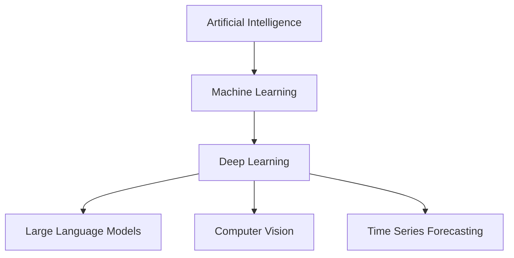

In financial services, AI/ML/DL can be used for fraud detection, credit scoring, customer segmentation, financial news analysis, risk modelling, document intelligence, compliance review, and forecasting.

### A FinTech Machine Learning Workflow

A useful machine learning project in finance usually follows a workflow like this:

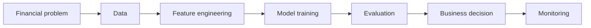

| Step | Question to ask | Example in finance |
| --- | --- | --- |
| Financial problem | What decision needs support? | Should this loan application be approved? |
| Data | What evidence is available? | Loan history, income, repayment records, credit bureau variables |
| Feature engineering | How do we turn raw data into model inputs? | Debt-to-income ratio, past delinquency count, utilization ratio |
| Model training | Which method learns the pattern? | Logistic regression, random forest, gradient boosting |
| Evaluation | What errors matter? | Missing a future default vs rejecting a good borrower |
| Business decision | How will the prediction be used? | Approve, reject, review manually, or adjust credit limit |
| Monitoring | Does performance stay reliable over time? | Track drift, approval rates, default rates, fairness, complaints |

!!! tip "Think in terms of the decision"
    Do not start by asking, "Which model should I use?" Start by asking, "What decision or prediction am I trying to support, what data do I have, and what kind of error is costly?"

!!! warning "A model score is not a business decision"
    A model can estimate risk, but a financial institution still needs policy rules, human review paths, monitoring, compliance checks, and clear accountability.

## 3. Supervised Learning

### 3.1 What Is Supervised Learning?

Supervised learning uses labelled data. Each training example has input features and a known target. The model learns a mapping from inputs to outputs.

For credit default prediction:

- Input features: income, credit history, loan amount, repayment history.
- Target: default or no default.

The model learns from historical examples and tries to predict the target for new examples.

!!! example "Supervised learning in FinTech"
    A fraud model can learn from past transactions labelled as fraud or non-fraud. A credit risk model can learn from past borrowers labelled as default or non-default. A sentiment model can learn from financial news labelled as positive, neutral, or negative.

### 3.2 Classification vs Regression

Classification predicts categories. Regression predicts numbers.

| Task | Output Type | Example | Possible Models |
| --- | --- | --- | --- |
| Classification | Category | Default / No Default | Logistic Regression, SVM, Random Forest |
| Regression | Number | Predict loss amount or next-month sales | Linear Regression, Random Forest Regressor |

In finance, classification is common for fraud detection, default prediction, churn prediction, or news sentiment classification. Regression is common for estimating prices, returns, losses, demand, or risk scores.

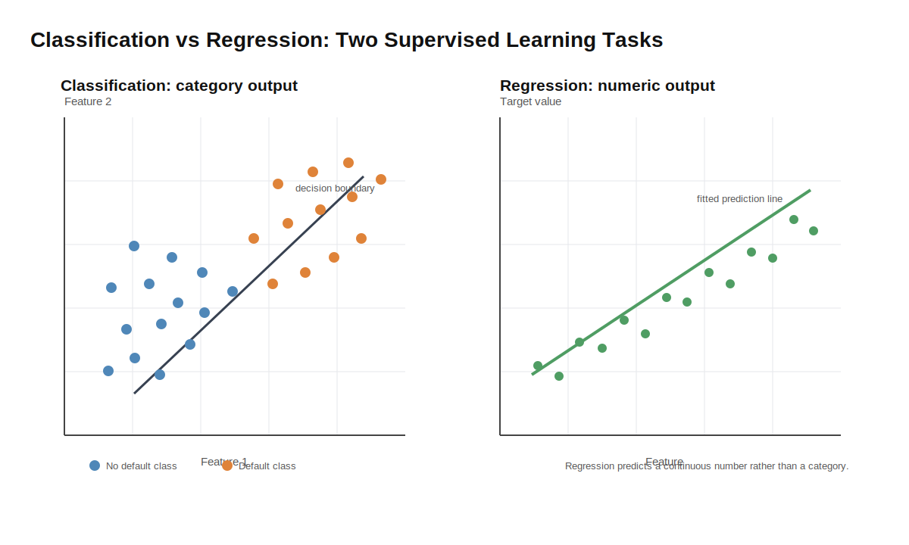
*Figure: Synthetic demo of category prediction and numeric prediction.*

!!! note "Choose the target carefully"
    A weak target creates a weak project. "Predict stock price" is often vague. "Predict whether next-month volatility will exceed a threshold" or "predict probability of default within 12 months" is usually easier to evaluate.

### 3.3 Case Study: Credit Default Prediction

Credit default prediction is a useful running example because it connects model training to business decisions.

| Component | Example |
| --- | --- |
| Business question | Will this borrower default within the next 12 months? |
| Unit of prediction | One borrower or one loan application |
| Input features | Income, employment length, loan amount, debt-to-income ratio, repayment history, credit utilization, past delinquency count |
| Target label | `1 = default`, `0 = no default` |
| Possible models | Logistic regression, decision tree, random forest, gradient boosting, neural network |
| Evaluation metrics | AUC, precision, recall, F1-score, calibration, approval/default rate by segment |
| Business use | Approve, reject, price risk, request manual review, adjust credit limit |

The model does not "know" whether someone is responsible or trustworthy. It only learns statistical patterns from historical data. That means the quality of the dataset, feature definitions, target label, and evaluation design matter as much as the algorithm.

#### Business Trade-Offs

For default prediction, define the positive class as "will default."

| Error type | Meaning | Business cost |
| --- | --- | --- |
| False positive | Model predicts default, but borrower would not default | Rejecting or overpricing a good customer; lost revenue; unfair customer experience |
| False negative | Model predicts no default, but borrower defaults | Credit loss; collection cost; capital and risk exposure |

Different lenders may choose different thresholds depending on risk appetite, regulation, and business strategy.

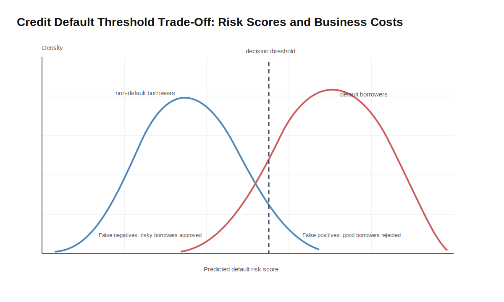
*Figure: A synthetic threshold example showing how false positives and false negatives change with the decision threshold.*

!!! warning "Do not evaluate only with accuracy"
    If defaults are rare, a model can achieve high accuracy by predicting "no default" most of the time. That may still be useless for risk management.

!!! tip "What to report"
    For a credit risk project, report at least one ranking metric such as AUC, one threshold-based metric such as precision or recall, and a short explanation of false positive and false negative costs.

!!! tip "Colab demo"
    See Section 10: [Credit Default Classification](https://colab.research.google.com/drive/1lUfqKy7RGHezSBJHhh4hc54WblU0yux7).

### 3.4 Naive Bayes

Naive Bayes is a probabilistic model based on Bayes' theorem. It assumes that features are conditionally independent given the class.

| Question | Answer |
| --- | --- |
| What does it do? | Estimates class probabilities from feature evidence. |
| When is it useful? | Fast baselines, text classification, and small datasets. |
| FinTech example | Classify financial news or customer messages into topics or sentiment categories. |
| Key limitation | The independence assumption can be unrealistic when features are correlated. |

This assumption is often unrealistic. For example, income, loan amount, and credit history may be related. Still, Naive Bayes can work well in practice, especially as a simple baseline or for text classification tasks.

!!! note "Why is it called naive?"
    It is called "naive" because it assumes features are independent from each other given the class label.

### 3.5 Logistic Regression

Despite the name, logistic regression is usually used for classification. It estimates the probability that an example belongs to a class.

For binary classification, it may estimate:

```text
P(default = yes | customer features)
```

| Question | Answer |
| --- | --- |
| What does it do? | Learns a weighted relationship between features and class probability. |
| When is it useful? | Strong baseline for binary classification, especially with tabular data. |
| FinTech example | Estimate probability of loan default or customer churn. |
| Key limitation | May miss complex non-linear interactions unless features are engineered well. |

Logistic regression is a strong baseline because it is fast, interpretable, and often difficult to beat on simple structured datasets. It is usually more robust than Naive Bayes when features are correlated.

Important variants and settings:

- L1 regularization can encourage sparse feature weights.
- L2 regularization can reduce overfitting by shrinking weights.
- Multinomial logistic regression, also called softmax regression, supports multi-class classification.

!!! example "Interpretable baseline"
    If a logistic regression model assigns a positive weight to past delinquency count, students can explain that higher delinquency count is associated with higher predicted default risk, assuming other features are held constant.

### 3.6 Support Vector Machine

Support Vector Machine tries to find a separating boundary between classes. In simple two-dimensional examples, this boundary is a line. In higher dimensions, it is called a hyperplane.

The margin is the distance between the boundary and the nearest data points. SVM tries to maximize this margin, which can make the classifier more robust.

Kernels allow SVM to handle non-linear boundaries. Common kernels include linear, RBF, polynomial, and sigmoid.

| Question | Answer |
| --- | --- |
| What does it do? | Finds a boundary that separates classes with a large margin. |
| When is it useful? | Small or medium datasets with clear class boundaries. |
| FinTech example | Classify suspicious vs normal transactions after feature engineering. |
| Key limitation | Can be slow on large datasets and less transparent for business users. |

!!! tip "Practical note"
    SVM can work well on small or medium-sized datasets, but it is not always the first choice for large-scale financial transaction systems.

### 3.7 Decision Tree

A decision tree makes predictions by asking a sequence of questions. Each internal node is a split, and each leaf gives a prediction.

For example, a simplified credit risk tree might ask:

```text
Is credit history poor?
If yes, is loan amount high?
If yes, predict high default risk.
```

| Question | Answer |
| --- | --- |
| What does it do? | Splits the data into rule-like branches. |
| When is it useful? | When interpretability and rule inspection matter. |
| FinTech example | Create a simple explainable rule tree for credit review triage. |
| Key limitation | A single tree can overfit and change sharply with small data changes. |

Decision trees are easy to explain and visualize. This makes them attractive when interpretability matters.

!!! warning "Decision trees can overfit"
    A small change in the training data can sometimes produce a very different tree. This makes single decision trees less robust than ensemble methods.

### 3.8 Random Forest

Random forest is an ensemble of decision trees. It uses bagging: many trees are trained on bootstrapped samples of the data, and the final prediction is made by voting or averaging.

| Question | Answer |
| --- | --- |
| What does it do? | Combines many decision trees to reduce instability. |
| When is it useful? | Strong baseline for tabular data with non-linear patterns. |
| FinTech example | Credit risk scoring, fraud detection, customer churn prediction. |
| Key limitation | Less interpretable than one tree and can still encode biased historical patterns. |

Random forests are usually more robust than a single decision tree because errors from individual trees can be averaged out.

| Model | Main Idea | Strength | Limitation |
| --- | --- | --- | --- |
| Naive Bayes | Probabilistic model with independence assumption | Fast and simple | Independence assumption is strong |
| Logistic Regression | Learns class probabilities | Interpretable baseline | Limited for complex non-linear patterns |
| SVM | Finds a maximum-margin boundary | Good for clear boundaries | Can be slow on large datasets |
| Decision Tree | Rule-based splits | Easy to explain | Can overfit |
| Random Forest | Many trees combined | Robust and strong baseline | Less interpretable than one tree |

## 4. Unsupervised Learning

### 4.1 What Is Unsupervised Learning?

Unsupervised learning works without target labels. The goal is to discover hidden patterns in data.

This matters in finance because labels are often missing, delayed, incomplete, or expensive to obtain. A fraud label may only appear after investigation. A default label may take months. A suspicious transaction may never receive a clean label. In these situations, unsupervised learning can help analysts explore the data before supervised labels are available.

Examples:

- Customer segmentation based on transaction behavior.
- Suspicious transaction grouping for analyst review.
- Anomaly discovery in payment streams.
- Grouping companies by financial ratios.
- Detecting unusual account activity.

!!! example "Customer segmentation"
    A bank may cluster customers by spending frequency, savings balance, investment activity, and digital app usage. The clusters can support product recommendation, service design, or risk monitoring.

### 4.2 K-means Clustering

K-means groups data into K clusters. Each cluster has a centroid. The algorithm repeatedly assigns points to the nearest centroid and updates the centroids.

In a FinTech project, students might use K-means to group customers by:

- Average monthly spend.
- Number of transactions.
- Account balance.
- Product holdings.
- Digital engagement.

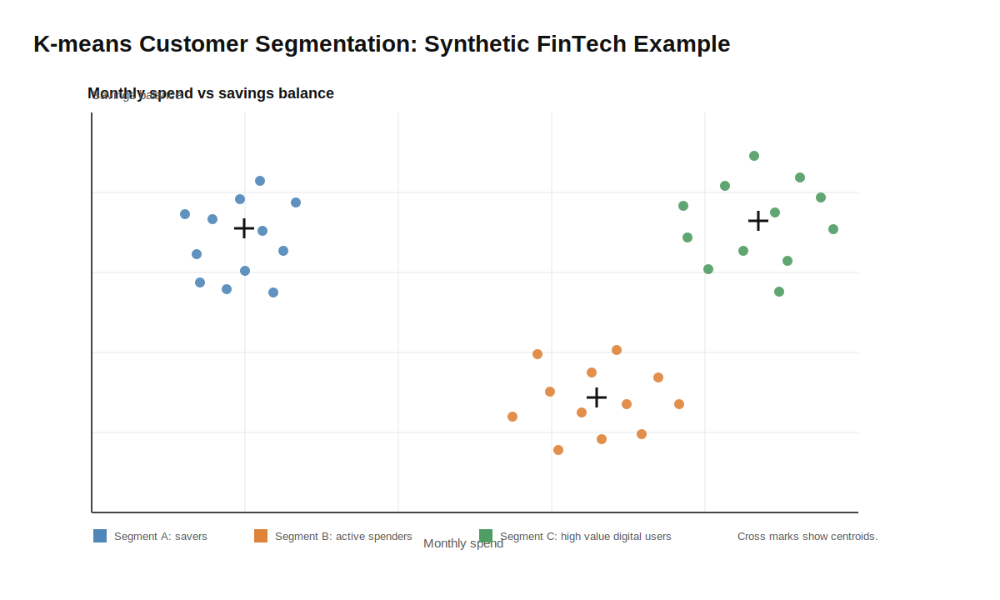
*Figure: Synthetic customer clusters. Cluster names require business interpretation.*

K-means is useful when you want a simple segmentation method, but it has limitations:

- You need to choose K.
- It can be sensitive to initial centroids.
- It works better when clusters are roughly spherical.
- It can be distorted if features are on very different scales.

!!! warning "Scale your features"
    If transaction count ranges from 0 to 1,000 and interest rate ranges from 0 to 0.1, the larger-scale feature can dominate clustering unless features are scaled.

!!! tip "Colab demo"
    See Section 10: [Customer Segmentation with K-means](https://colab.research.google.com/drive/1LJcA5_bPLzG2KQ9yqy4K9OUHCIF4JIVu).

### 4.3 Agglomerative Clustering

Agglomerative clustering is a hierarchical clustering method. It starts with each point as its own cluster and repeatedly merges the most similar clusters.

It can be visualized with a dendrogram, which helps students see how small clusters merge into larger groups. This can be useful when analysts want to explore whether customer groups form naturally at different levels of granularity.

!!! tip "When hierarchy helps"
    Hierarchical clustering can be useful when you do not know the number of groups and want to inspect several possible groupings.

### 4.4 Choosing the Number of Clusters

Choosing the number of clusters is part of the modelling decision. Two common tools are the elbow method and silhouette score.

| Method | What It Checks | Interpretation |
| --- | --- | --- |
| Elbow Method | Within-cluster variation | Look for the point where improvement slows down |
| Silhouette Score | Separation and compactness | Higher score usually indicates better clustering |

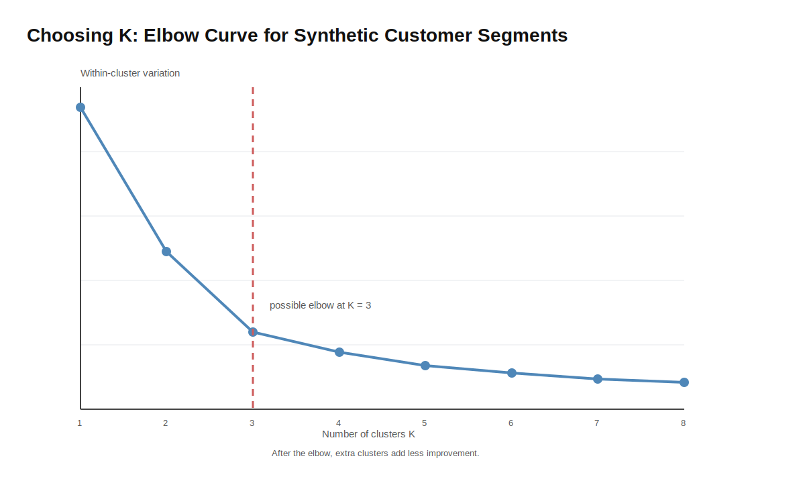
*Figure: A synthetic elbow curve. The elbow suggests a candidate value of K, but it does not prove that the clusters are useful.*

!!! warning "Clusters need interpretation"
    A clustering algorithm can always produce groups, but those groups are only useful if they make sense for the business or research question.

!!! note "No labels does not mean no evaluation"
    Even without labels, you can evaluate clusters by stability, interpretability, separation, and whether domain experts can act on them.

## 5. Deep Learning

Deep learning is a family of machine learning methods based on neural networks with multiple layers. The important idea is not only that the model is "deep." The important idea is that layers can transform raw input into more useful internal representations.

### 5.1 From Features to Representations

Classical machine learning often depends heavily on manually designed features. For example, a classical fraud model may use features such as transaction amount, transaction frequency, merchant category, distance from usual location, and number of failed login attempts.

Deep learning can still use engineered features, but it is often useful when the model can learn patterns from less structured inputs such as text, images, or sequences. For example, a deep learning model may learn useful patterns from a sequence of customer transactions, a scanned bank statement, or a financial news article.

| Approach | How features are created | Example |
| --- | --- | --- |
| Classical ML | Humans design many input features | Debt-to-income ratio, utilization ratio, past delinquency count |
| Deep learning | Layers learn intermediate representations | Text embeddings, visual layout features, sequence patterns |

!!! note "Representation learning"
    A representation is a transformed version of the input data that makes the prediction task easier. Deep learning models learn these transformations through layers.

!!! example "Fraud detection intuition"
    A classical model may receive a feature called "number of overseas transactions in the past 7 days." A sequence model may instead read the transaction history step by step and learn that a sudden overseas transaction is unusual for this customer.

### 5.2 Artificial Neural Networks

An artificial neural network is built from layers of neurons. A neuron takes input values, multiplies them by weights, adds a bias, and passes the result through an activation function. A layer contains many neurons, and each hidden layer transforms the previous layer into a new representation.

The output layer produces the final prediction. In financial services, this might be a default probability, fraud probability, churn probability, document category, sentiment label, or forecast value.

Key terms:

| Term | Meaning |
| --- | --- |
| Input layer | Receives input features |
| Hidden layers | Transform inputs into learned representations |
| Output layer | Produces the final prediction |
| Weights | Learned parameters that control connections |
| Bias | Learned offset added to a neuron |
| Activation function | Adds non-linearity so the model can learn complex patterns |

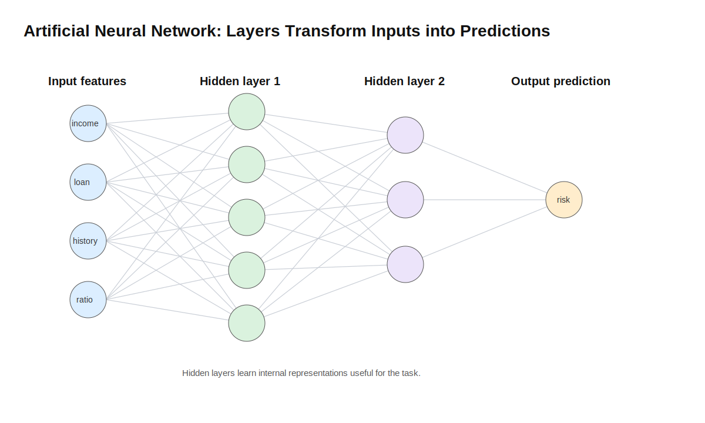
*Figure: A neural network transforms input features through hidden layers before producing an output prediction.*

In FinTech, neural networks may be used for high-volume fraud signals, document understanding, customer behaviour modelling, or time series prediction. However, they usually require more data, more tuning, and more careful monitoring than simpler models.

!!! tip "Start with the data structure"
    A plain ANN can work with structured numeric features, but it does not automatically understand images, text, or time order. CNNs, RNNs, and LSTMs add structure that better matches those data types.

### 5.3 Feedforward, Loss, Backpropagation, and Optimizer

Training a neural network is an optimization process. The model repeatedly makes predictions, measures errors, and updates its weights.

| Step | Meaning | Example |
| --- | --- | --- |
| Feedforward | Produce a prediction | Estimate default probability |
| Loss | Measure error | Prediction is too high or too low |
| Backpropagation | Compute update direction | Which weights increased error? |
| Optimizer | Update weights | Adjust model parameters |

In plain language:

```text
make prediction -> measure error -> calculate how to reduce error -> update weights
```

!!! note "Training is optimization"
    Neural networks do not learn rules in the human sense. They adjust many numerical parameters to reduce prediction error on training data.

!!! warning "Training accuracy is not enough"
    A neural network can fit training data very well but still fail on new data. Always evaluate on validation or test data.

### 5.4 Overfitting and Dropout

Large neural networks can memorize training examples instead of learning patterns that generalize. This is overfitting. Dropout is one technique for reducing overfitting.

During training, dropout randomly disables some neurons. This forces the network to avoid relying too much on one pathway. During normal prediction, dropout is not used in the same random way.

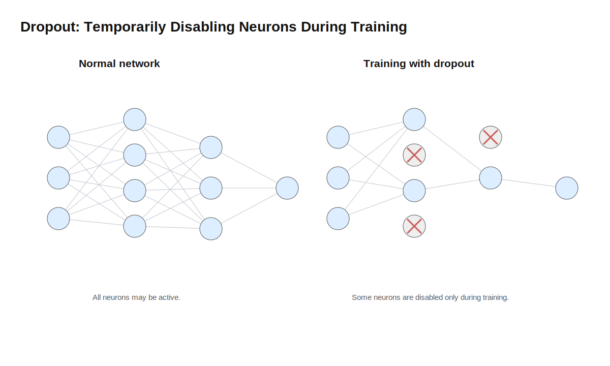
*Figure: Dropout temporarily disables some neurons during training so the model learns more robust pathways.*

!!! tip "Intuition for dropout"
    Dropout makes the model practice with incomplete internal pathways. This can reduce memorization, but it does not replace proper validation, enough data, or careful feature design.

### 5.5 CNN: Learning Local Patterns

CNN stands for Convolutional Neural Network. CNNs are designed for data where nearby values form meaningful local patterns.

In an image, nearby pixels can form edges, shapes, characters, stamps, tables, signatures, and document regions. A filter, also called a kernel, slides over the input and detects a local pattern. The result is a feature map. Pooling can reduce the size of the representation while keeping important signals. Later layers combine simple patterns into more complex patterns.

One filter produces one feature map. A CNN usually learns many filters, so each convolution layer can produce many feature maps. This is how the model can detect different local patterns such as edges, corners, table lines, stamps, or handwritten marks.

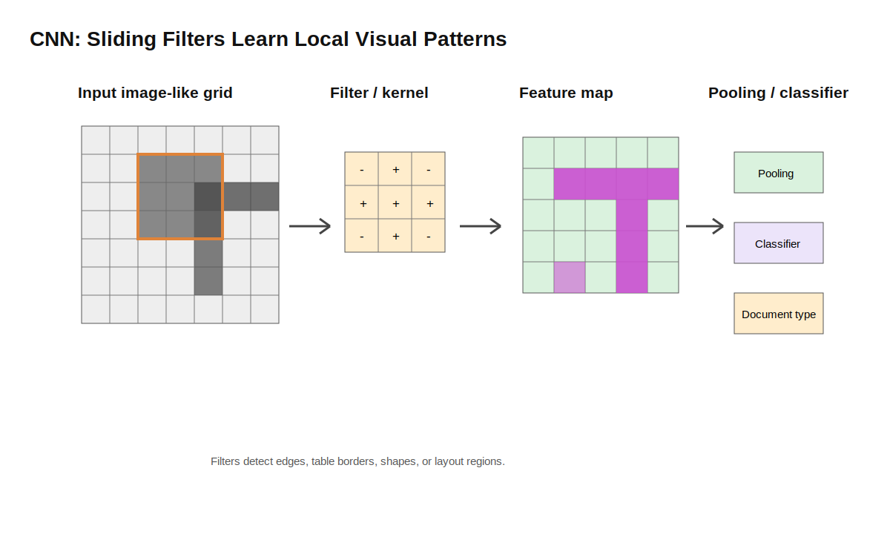
*Figure: A CNN learns local visual patterns by sliding filters over an image-like input. In financial services, this can help with scanned documents, forms, charts, or layout-heavy files.*

!!! example "Scanned financial document"
    A CNN processing a scanned bank statement may first detect edges and characters, then table borders, then document regions such as totals, dates, account numbers, or signatures.

FinTech examples:

- Scanned invoice or bank statement classification.
- Cheque or form image processing.
- Document layout understanding.
- Chart image pattern recognition.
- OCR post-processing with visual layout features.

Limitations:

- CNNs need enough labelled image data.
- They may be sensitive to image quality, rotation, blur, or layout changes.
- For text-only financial data, CNNs may not be the best first choice.
- For tabular credit data, random forest or gradient boosting may be simpler and stronger.

!!! tip "Colab demo"
    See Section 10: [CNN Filter Visualization](https://colab.research.google.com/drive/1cM3CM8iESixVRcFJz37JLlJMl8fcdL7W).

### 5.6 RNN: Learning from Sequences

RNN stands for Recurrent Neural Network. RNNs are designed for ordered sequences. The model processes one step at a time. At each step, it uses both the current input and a hidden state from the previous step.

The hidden state is a compact memory of earlier information. This is useful when the meaning of the current step depends on what happened before.

At each time step, the RNN updates its hidden state using the current input and the previous hidden state. The same model is reused across the sequence, which is why it is called recurrent.

```text
transaction_1 -> hidden_1
transaction_2 + hidden_1 -> hidden_2
transaction_3 + hidden_2 -> hidden_3
final hidden state -> fraud risk
```

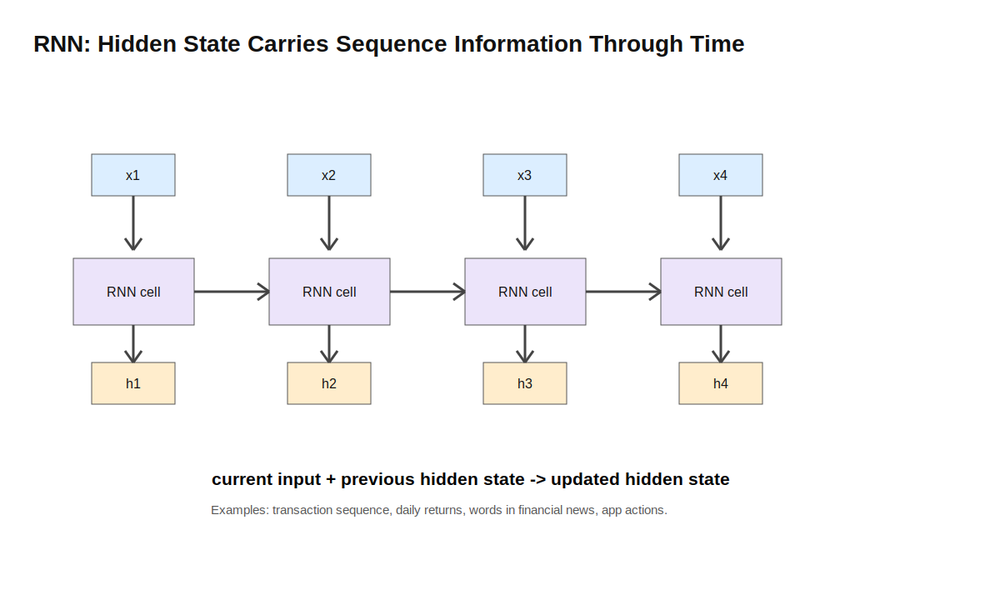
*Figure: An RNN carries a hidden state through time. This lets later predictions depend on earlier sequence information.*

Sequence examples in FinTech:

- A transaction sequence for one customer.
- A sequence of daily returns.
- A sequence of words in a financial news sentence.
- A sequence of customer actions in a banking app.

| Pattern | Meaning | Example |
| --- | --- | --- |
| Many-to-one | Sequence input, one output | Transaction history -> fraud risk |
| Many-to-many | Sequence input, sequence output | Text sequence -> tag sequence |
| Sequence forecasting | Past values -> future values | Past returns -> next value |

!!! warning "RNN limitations"
    RNNs process data sequentially, so training can be slow. Long sequences are difficult because earlier information may fade. Modern Transformer models often replace RNNs for many NLP tasks, but RNNs are still useful for understanding the idea of sequence memory.

### 5.7 LSTM: Remembering Longer-Term Patterns

LSTM stands for Long Short-Term Memory. It is a special type of RNN designed to handle longer-term dependencies. A normal RNN may gradually lose information from earlier time steps. LSTM introduces a memory cell and gates to control information flow.

| Gate | Intuition | Question it answers |
| --- | --- | --- |
| Forget gate | Removes irrelevant memory | What should we forget? |
| Input gate | Adds new useful information | What new information should we store? |
| Output gate | Controls what to expose | What part of memory should influence the output? |

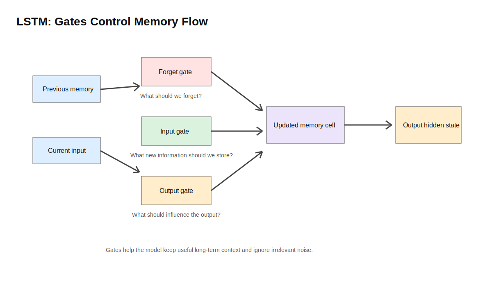
*Figure: LSTM uses gates to decide what to forget, what to store, and what to output. This helps it handle longer sequences better than a simple RNN.*

!!! example "Transaction behaviour context"
    A single large purchase today may be less important if a customer often makes such purchases. But if a customer has a long history of small local payments and suddenly makes a large overseas transaction, the model may need both recent and older context.

Homework 4 uses LSTM for time series prediction. Students should understand that the raw time series is converted into windows, and the LSTM learns patterns across each window.

!!! note "LSTM is not magic memory"
    LSTM does not remember everything. The gates give the model a better mechanism to keep or discard information, but whether it learns useful long-term patterns still depends on data quality, sequence length, training design, and validation.

Limitations:

- LSTM is not automatically better than ARIMA, GARCH, or simple baselines.
- LSTM requires careful scaling, chronological splitting, and enough data.
- LSTM can produce visually smooth predictions while not truly forecasting well.
- Always compare against a naive baseline.

### 5.8 Choosing ANN, CNN, RNN, or LSTM

| Model | Best suited for | FinTech example | Avoid using when |
| --- | --- | --- | --- |
| ANN | Structured numeric features | Credit risk with engineered features | Simpler models perform equally well |
| CNN | Image-like or spatial data | Scanned forms, document images, chart images | Data is purely tabular |
| RNN | Ordered sequences | Customer action sequence, short time series | Long-range dependencies are important |
| LSTM | Longer sequences | Time series forecasting, transaction behaviour | Data is small or baseline is strong |

!!! tip "Match model architecture to data structure"
    CNNs are designed for local spatial patterns. RNNs and LSTMs are designed for ordered sequences. For ordinary tabular financial data, start with simpler classical ML baselines.

!!! tip "Quick Decision Rule"
    - If the data is tabular, start with logistic regression, random forest, or gradient boosting.
    - If the data is image-like, consider CNN.
    - If the data is ordered over time, consider RNN or LSTM.
    - If the data is long text, modern Transformer models are often stronger than RNNs.
    - If the dataset is small, start simple before using deep learning.

### 5.9 Should We Always Use Deep Learning?

No. Deep learning is powerful, but it is not automatically better. It may improve performance, but it also increases complexity.

Classical machine learning models are often strong baselines in financial services, especially when:

- The data is tabular.
- The dataset is not huge.
- Interpretability matters.
- The organization needs a model that is easy to validate and monitor.
- The problem can be solved well with engineered features.

Deep learning may be more appropriate when:

- The data is unstructured, such as images, text, speech, or long sequences.
- There is enough training data.
- The problem benefits from representation learning.
- The team can support tuning, monitoring, and explainability work.

In regulated financial services, explainability, monitoring, data governance, and robustness are often as important as raw accuracy. Students should treat deep learning as one tool, not the default answer.

!!! warning "Complex models can create governance problems"
    A model that is slightly more accurate but much harder to explain, validate, and monitor may not be the best choice in a regulated financial setting.

## 6. Natural Language Processing

### 6.1 What Is NLP?

Natural Language Processing allows machines to process, analyze, and generate human language.

Examples in financial services:

- Sentiment analysis of financial news.
- Summarizing annual reports.
- Classifying customer support messages.
- Extracting information from contracts.
- Building financial chatbots.

### 6.2 Sentiment Analysis

Sentiment analysis classifies text as positive, negative, or neutral. It can be treated as a classification problem.

Example:

```text
Financial news headline -> positive / neutral / negative market sentiment
```

The output should be used cautiously. A positive headline does not guarantee a price increase, and a negative article may already be reflected in the market.

### 6.3 Text Preprocessing

Text preprocessing converts raw text into a cleaner form that models can use.

| Step | Purpose |
| --- | --- |
| Tokenization | Split text into words or subwords |
| Lowercasing | Make text case consistent |
| Stop word removal | Remove common low-information words |
| Stemming | Cut words to rough root forms |
| Lemmatization | Convert words to dictionary base forms |
| POS tagging | Identify grammatical role of words |

!!! tip "Match preprocessing to the model"
    For traditional models such as TF-IDF plus logistic regression, preprocessing can be important. For Transformer-based models, aggressive preprocessing such as stop word removal or stemming may remove useful context, so preprocessing should match the model type.

### 6.4 Word Representation

Machine learning models need numbers, so text must be converted into numerical representations.

| Method | Idea | Limitation |
| --- | --- | --- |
| One-hot | Sparse vector for each word | No semantic similarity |
| TF-IDF | Weights important words | Still sparse |
| Word2Vec | Dense learned embeddings | Needs training data |
| FastText | Uses subword information | More complex |
| Transformer embeddings | Context-aware representation from models such as BERT | More computationally expensive and less transparent |

Unlike Word2Vec, which usually gives one vector per word, Transformer representations can change depending on context. For example, "bank" in "central bank" and "river bank" can receive different contextual meanings.

### 6.5 Practical Pipeline: Financial News Sentiment

A financial news sentiment analysis project might follow this pipeline:

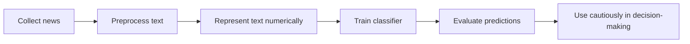

| Step | Practical question |
| --- | --- |
| Data collection | Which news sources, dates, tickers, and languages are included? |
| Preprocessing | Are headlines, article bodies, or both used? |
| Representation | TF-IDF, embeddings, or transformer representations? |
| Classification | Positive, neutral, negative, or more specific labels? |
| Evaluation | Accuracy, F1-score, per-class recall, or human review? |
| Decision use | Is sentiment a signal, an explanation aid, or an alert? |

!!! warning "Text labels can be subjective"
    Two people may disagree on whether a financial article is positive or neutral. Label quality should be checked before trusting the model.

!!! tip "Colab demo"
    See Section 10: [Financial News Sentiment with TF-IDF](https://colab.research.google.com/drive/1MmdrmNlyrwVvTPpj3ATcGZ3eIRP-JeIg).

### 6.6 Topic Modelling

Topic modelling discovers hidden themes in a document collection. LDA is a common topic modelling method.

Topic modelling is different from supervised text classification. Sentiment analysis usually needs labelled text, such as positive, neutral, or negative examples. Topic modelling can explore a large document collection without predefined labels.

In finance, topic modelling can help group news articles, annual report sections, analyst notes, compliance documents, or customer messages.

!!! example "Customer complaint analysis"
    A bank may collect thousands of customer complaints. Topic modelling may reveal themes such as "mobile app login", "credit card fees", "loan approval delay", or "fraud dispute". These topics can help analysts understand major customer pain points before building a supervised classifier.

| Use case | What topic modelling can help discover |
| --- | --- |
| Customer complaints | Frequent pain points and service issues |
| Analyst reports | Common discussion themes across companies |
| Annual reports | Risk, strategy, governance, or sustainability themes |
| Compliance documents | Repeated policy or control topics |

!!! warning "Topics still need human interpretation"
    Topic labels are not automatically meaningful. The model returns word groups, and humans still need to interpret, name, and validate the topics.

### 6.7 LLMs and Transformers

LLMs are large models trained on large text datasets. Many modern LLMs are based on Transformer architecture. Examples include BERT, Llama, and GPT-style models. Hugging Face is a platform for finding and using open-source models.

Examples of LLM use in financial services include:

- Report summarization.
- Contract clause extraction.
- Document question answering.
- Compliance search.
- Customer service assistants.
- Drafting analyst notes for human review.

!!! note "Retrieval-augmented generation"
    In financial document question answering, LLMs are often combined with retrieval. The system first finds relevant source documents, then asks the LLM to answer using those sources. This can reduce hallucination, but it does not remove the need for verification.

Risks include:

- Hallucination: fluent but incorrect answers.
- Outdated information.
- Sensitive data leakage.
- Lack of explainability.
- Inconsistent answers across prompts.
- Overreliance by users who do not verify outputs.

!!! warning "LLMs are powerful but not always reliable"
    LLMs can generate fluent text that may still be incorrect. In financial services, their outputs should be evaluated carefully and used with appropriate safeguards.

!!! tip "Safer LLM use"
    Use LLM outputs as drafts, summaries, or search aids. For high-stakes financial decisions, keep human review, source citations, access control, and audit logs.

## 7. Time Series Analysis

### 7.1 What Is Time Series Data?

Time series data consists of observations ordered by time.

Examples:

- Stock prices
- Trading volume
- Exchange rates
- Interest rates
- Volatility
- Transaction count

Time order matters because future values should not be used to train a model that claims to predict the future.

!!! warning "Not guaranteed trading systems"
    Accurate price prediction is difficult because markets respond to new information quickly. In this page, time series models should be understood as tools for learning patterns, building baselines, and modelling risk, not as guaranteed trading systems.

### 7.2 Common Time Series Patterns

| Pattern | Meaning | Example |
| --- | --- | --- |
| Trend | Long-term movement | Stock index rising over years |
| Seasonality | Repeating pattern at fixed intervals | Higher spending during holidays |
| Cyclic | Business-cycle-like movement | Economic expansion and recession |
| Irregularity | Random shock or noise | Market crash or policy announcement |

### 7.3 Forecasting Values vs Forecasting Volatility

Finance often cares about two different questions:

- What value will come next?
- How risky or volatile will the next period be?

Forecasting the next stock price or next sales value is a value forecasting problem. Forecasting how unstable returns may be is a volatility forecasting problem. These are not the same.

!!! note "Finance often models transformed targets"
    In financial applications, modelling raw prices is not always the best target. Many projects model returns, risk scores, default events, transaction counts, or volatility because these targets are closer to the decision being made.

| Financial question | Possible target | Possible model |
| --- | --- | --- |
| What is next month's transaction volume? | Future value | ARIMA, regression, LSTM |
| How volatile will returns be next week? | Future volatility | GARCH, volatility features, LSTM |
| Will default risk rise next quarter? | Future risk label or score | Logistic regression, random forest, time-aware ML |
| Will suspicious activity increase? | Future count or anomaly score | ARIMA, anomaly detection, supervised classifier |

### 7.4 ARIMA

ARIMA stands for AutoRegressive Integrated Moving Average. It is a classical statistical model for forecasting time series. It is usually used for relatively simple univariate time series and is a useful baseline before trying LSTM.

| Part | Meaning | Intuition |
| --- | --- | --- |
| AR: AutoRegressive | Uses past values | Recent transaction volume may help predict next month's volume |
| I: Integrated | Uses differencing to make the series more stable | Remove a trend before modelling the remaining movement |
| MA: Moving Average | Uses past forecast errors | Correct the current forecast using recent prediction mistakes |

!!! example "Monthly transaction volume"
    If monthly transaction volume has a trend, ARIMA may first difference the series to reduce the trend, then use previous values and previous forecast errors to predict the next month.

ARIMA is often useful as a baseline because it is more transparent than many complex models. If an LSTM cannot clearly beat a sensible ARIMA or naive baseline, students should be cautious about claiming that the deep learning model is useful.

### 7.5 GARCH

GARCH models time-varying volatility. It is useful in finance because volatility changes over time.

Financial returns often show volatility clustering: calm periods are followed by calm periods, and turbulent periods are followed by turbulent periods. GARCH is designed to model this changing volatility.

A risk team may not only ask whether the return will be positive tomorrow. It may ask whether tomorrow's market risk will be high. GARCH is more aligned with this volatility question.

GARCH uses past errors and past variances to estimate current volatility. It is better aligned with risk and volatility questions than with predicting price levels directly.

!!! warning "Volatility is not direction"
    GARCH does not directly predict the exact price direction. It mainly models conditional variance, so students should not confuse volatility forecasting with price forecasting.

### 7.6 LSTM for Time Series

LSTM can learn non-linear sequence patterns and may capture relationships that classical models miss. However, it requires careful preprocessing, enough data, and proper validation.

| Model | Main use in finance | Strength | Limitation |
| --- | --- | --- | --- |
| ARIMA | Forecast values in a time series | Transparent baseline | Limited for complex non-linear patterns |
| GARCH | Forecast volatility | Designed for changing volatility | Focused on variance, not general prediction |
| LSTM | Learn sequence patterns | Can model non-linear dependencies | Needs more data and careful validation |

!!! tip "Colab demo"
    See Section 10: [LSTM Time Series Prediction](https://colab.research.google.com/drive/1dZR8Jnz-Y-jRYesY-jrbx7WW1xovS_aL).

### 7.7 Time Series Validation

Wrong validation can make a weak model look strong.

!!! warning "Wrong: random split"
    Randomly splitting stock price data mixes earlier and later periods. The model may train on future market conditions and then appear to perform well on the past. This is unrealistic for forecasting.

!!! example "Correct: split by date"
    Train on earlier periods and test on later periods. For example, train on 2020-2023 data and test on 2024 data.

```text
Train: 2020 -> 2023
Test:  2024
```

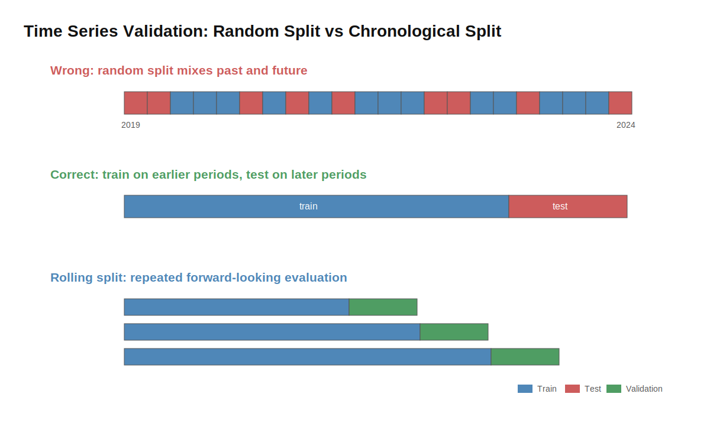
*Figure: Random splits can mix past and future data. Chronological and rolling splits better match real forecasting conditions.*

## 8. Helpful ML Techniques

### 8.1 Train, Validation, and Test Split

| Dataset | Purpose |
| --- | --- |
| Training set | Fit the model |
| Validation set | Tune hyperparameters |
| Test set | Final evaluation |

The test set should be used only for final evaluation. If you repeatedly tune the model based on the test set, it is no longer a fair test.

### 8.2 Cross Validation

K-fold cross validation splits data into K parts. Each part is used once as validation, and the average performance is reported.

This can produce a more stable estimate of performance for non-time-series data.

### 8.3 Time Series Split

Time series split preserves time order. The training set always comes before the validation set. This prevents future information leakage.

| Split type | Appropriate for time series? | Reason |
| --- | --- | --- |
| Random split | Usually no | Can leak future patterns into training |
| Chronological split | Yes | Tests whether earlier data predicts later data |
| Rolling split | Yes | Simulates repeated forecasting over time |

### 8.4 Hyperparameter Tuning

Hyperparameters are settings chosen before training. Examples include tree depth, learning rate, number of estimators, and regularization strength.

GridSearchCV can test combinations of hyperparameters, but students should remember that tuning should happen on training and validation data, not the final test set.

### 8.5 Imbalanced Data

Accuracy can be misleading when classes are imbalanced. For example, if only 1% of customers default, always predicting "no default" gives 99% accuracy but is not useful.

Common techniques include:

- Oversampling
- Undersampling
- SMOTE
- Class weights
- Threshold tuning
- Metrics such as precision, recall, F1-score, and PR-AUC

In financial problems such as fraud detection, AML monitoring, and default prediction, SMOTE is not always the first or best option. Class weights and threshold tuning are often practical because they adjust model training or business decision rules without inventing synthetic customers or transactions.

!!! warning "Resampling must happen inside the training process"
    If you apply oversampling before splitting data, synthetic or duplicated examples can leak into validation or test data.

!!! tip "Separate model score from decision threshold"
    A model may output a fraud probability, but the business still needs to decide which threshold triggers a block, alert, or manual review.

!!! tip "Colab demo"
    See Section 10: [Imbalanced Fraud Detection](https://colab.research.google.com/drive/1pyJIHCU6L1Y0CzU3VFBVqKnr4Ulq4KOq).

### 8.6 Ensemble Learning

Ensemble learning combines multiple models.

| Method | Training Style | Example |
| --- | --- | --- |
| Bagging | Parallel, independent models | Random Forest |
| Boosting | Sequential, adaptive models | AdaBoost, Gradient Boosting |

### 8.7 Gradient Boosting

Gradient boosting builds many small models sequentially. Each new model tries to correct errors made by earlier models. In practice, gradient boosting methods are often strong baselines for tabular financial data.

| Question | Answer |
| --- | --- |
| What does it do? | Combines many weak learners into a stronger predictive model. |
| When is it useful? | Structured datasets with non-linear patterns and feature interactions. |
| FinTech example | Credit default prediction, fraud scoring, churn prediction, or risk ranking. |
| Key limitation | Can overfit, can be sensitive to leakage, and is less transparent than a simple linear model. |

!!! tip "Strong practical baseline"
    Before using a deep neural network on tabular credit or fraud data, compare against logistic regression, random forest, and gradient boosting. These classical ML models are often difficult to beat in financial services.

## 9. Evaluation Metrics

Evaluation metrics are not just numbers. They express what kind of error matters.

### 9.1 Confusion Matrix

For credit default prediction, let:

- Positive class = customer defaults.
- Negative class = customer does not default.

| Case | Meaning |
| --- | --- |
| TP | Predicted default, actually default |
| FP | Predicted default, actually no default |
| TN | Predicted no default, actually no default |
| FN | Predicted no default, actually default |

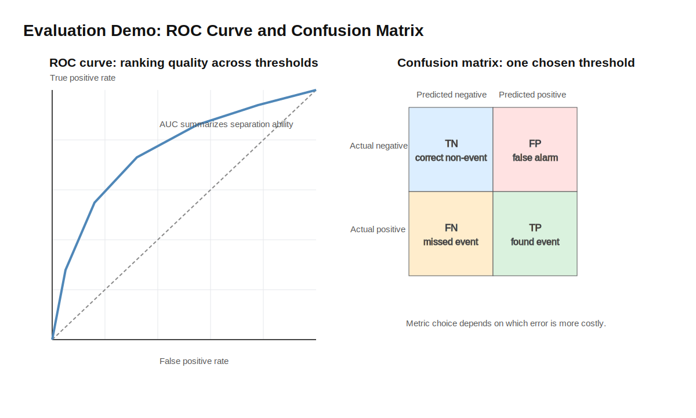
*Figure: ROC-AUC evaluates ranking across thresholds, while the confusion matrix shows the result after choosing one threshold.*

### 9.2 Business Costs of Errors

The same metric can mean different things for different financial problems.

| Problem | False positive cost | False negative cost | Metric often emphasized |
| --- | --- | --- | --- |
| Fraud detection | Blocking a legitimate transaction; customer friction | Missing fraud; financial loss | Recall, precision, PR-AUC |
| Credit default prediction | Rejecting a good borrower; lost revenue | Approving a borrower who defaults | AUC, recall, precision, calibration |
| AML monitoring | Unnecessary investigation workload | Missing suspicious activity | Recall, precision, alert quality |
| Customer churn | Offering incentives to customers who would stay | Losing customers without intervention | Precision, recall, uplift metrics |

!!! note "There is no universal best metric"
    Metric choice depends on the decision, the class imbalance, and the cost of different errors.

### 9.3 Accuracy

Accuracy measures overall correctness.

```text
Accuracy = correct predictions / all predictions
```

Accuracy can be misleading for imbalanced datasets.

### 9.4 Precision

Precision answers:

```text
Of all cases predicted as positive, how many were actually positive?
```

Precision is useful when false positives are costly.

### 9.5 Recall

Recall answers:

```text
Of all actual positive cases, how many did the model find?
```

Recall is useful when false negatives are costly.

### 9.6 F1-score

F1-score balances precision and recall using the harmonic mean. It is useful when classes are imbalanced and you need a single metric that considers both false positives and false negatives.

### 9.7 ROC and AUC

The ROC curve compares true positive rate and false positive rate across thresholds. AUC measures how well the model separates positive and negative classes. Higher AUC is generally better.

AUC measures ranking ability, not the quality of the final decision threshold. A model with high AUC still needs a threshold before it can approve, reject, block, or alert.

| Metric | Best Used When |
| --- | --- |
| Accuracy | Classes are balanced |
| Precision | False positives are costly |
| Recall | False negatives are costly |
| F1-score | Need balance between precision and recall |
| ROC-AUC | Need threshold-independent ranking quality |
| PR-AUC | Positive class is rare and precision-recall trade-offs matter |

!!! tip "Metric choice is part of modelling"
    In financial services, choosing the wrong metric can make a model look useful even when it fails the real business problem.

!!! note "PR-AUC for rare events"
    PR-AUC can be useful for highly imbalanced problems such as fraud detection, AML alerting, or rare default events because it focuses on precision and recall for the positive class.

## 10. Optional Google Colab Notebooks

These notebooks are optional runnable examples. They are designed to help you connect the lecture concepts with practical ML workflows. You do not need to master every line of code, but you should understand the workflow, the plots, and the evaluation logic.

| Notebook | Related Sections | Main Idea |
| --- | --- | --- |
| Credit Default Classification ([Open in Colab](https://colab.research.google.com/drive/1lUfqKy7RGHezSBJHhh4hc54WblU0yux7)) | Supervised Learning, Evaluation Metrics | Train classifiers, inspect ROC-AUC, and tune thresholds |
| Customer Segmentation with K-means ([Open in Colab](https://colab.research.google.com/drive/1LJcA5_bPLzG2KQ9yqy4K9OUHCIF4JIVu)) | Unsupervised Learning | Cluster customers and interpret segment profiles |
| Financial News Sentiment with TF-IDF ([Open in Colab](https://colab.research.google.com/drive/1MmdrmNlyrwVvTPpj3ATcGZ3eIRP-JeIg)) | NLP | Convert headlines into TF-IDF features and classify sentiment |
| LSTM Time Series Prediction ([Open in Colab](https://colab.research.google.com/drive/1dZR8Jnz-Y-jRYesY-jrbx7WW1xovS_aL)) | Time Series, Homework 4 | Create sliding windows and compare LSTM with a naive baseline |
| Imbalanced Fraud Detection ([Open in Colab](https://colab.research.google.com/drive/1pyJIHCU6L1Y0CzU3VFBVqKnr4Ulq4KOq)) | Imbalanced Data, Metrics | See why accuracy can be misleading for rare fraud events |
| CNN Filter Visualization ([Open in Colab](https://colab.research.google.com/drive/1cM3CM8iESixVRcFJz37JLlJMl8fcdL7W)) | CNN | Visualize how filters produce feature maps |

!!! note "Synthetic data"
    Some notebooks use synthetic data. Synthetic data is useful for learning workflows, but it should not be interpreted as real financial evidence.

## 11. Homework 4 Guide: LSTM Time Series Prediction

Students are asked to try the LSTM time series prediction tutorial and submit a PDF or Word document with code and screenshots.

### 11.1 Purpose of the Homework

The purpose is not only to run code, but to understand:

- How time series data is prepared.
- How sequence windows are created.
- How an LSTM model is trained.
- How predictions are compared with actual values.
- Why evaluation must respect time order.

### 11.2 What to Look for When Running the LSTM Tutorial

When running the tutorial, pay attention to:

| Item | What to check |
| --- | --- |
| Sequence window creation | How many past time steps are used to predict the next value? |
| Normalization | Is scaling fit on training data only? |
| LSTM input shape | Does the input have the expected shape: samples, time steps, features? |
| Chronological splitting | Does training data come before test data? |
| Prediction plots | Are predicted and actual values compared over time? |
| Genuine learning | Is the model learning a pattern, or only copying the previous value? |

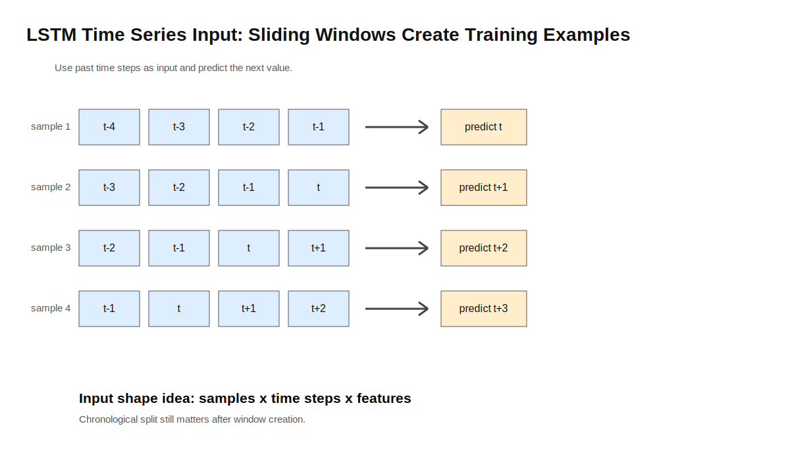
*Figure: LSTM time series tutorials usually convert one time series into many sliding-window training examples.*

!!! warning "A smooth prediction line is not enough"
    A plot may look visually reasonable even when the model has weak predictive value. Compare against simple baselines and explain limitations.

!!! tip "Compare with a naive baseline"
    Add a simple baseline such as "predict the previous value as the next value." If the LSTM cannot clearly improve on this baseline, discuss why the model may not be learning useful predictive structure.

### 11.3 Suggested Report Structure

1. Objective: What is the prediction task?
2. Dataset: What data is used? What is the target variable?
3. Preprocessing: How is the data normalized? How are sequences created?
4. Model: What does the LSTM architecture look like?
5. Training: What parameters are used? How many epochs?
6. Results: Include screenshots and plots.
7. Reflection: Did the model perform well? What limitations did you observe?

### 11.4 Submission Checklist

- Code is included or clearly shown.
- Screenshots show successful execution.
- A plot compares predicted and actual values.
- The report explains preprocessing.
- The report explains the LSTM model briefly.
- The report includes a short reflection.
- The report explains why the data split respects time order.

!!! warning "Do not submit screenshots only"
    Your report should include short explanations. The goal is to show that you understand the workflow, not only that the code ran successfully.

## 12. Final Review Checklist

Before moving on, check whether you can answer these questions:

**Conceptual Understanding**

- What is the difference between AI, ML, and DL?
- What is the difference between supervised and unsupervised learning?
- What is the difference between classification and regression?
- What is dropout?
- What preprocessing steps are common in NLP?
- What is the difference between stemming and lemmatization?

**Model Selection**

- Why is Naive Bayes called naive?
- Why is logistic regression useful as a baseline?
- What does an SVM hyperplane do?
- Why can decision trees overfit?
- Why is random forest more robust than a single tree?
- What does K-means do?
- How can we choose the number of clusters?
- Why are LSTMs useful for time series?
- Why might classical ML be better than deep learning for some tabular finance problems?

**Evaluation and Business Risk**

- Why can accuracy be misleading?
- What is the difference between precision and recall?
- What does ROC-AUC measure?
- How do false positives and false negatives create different business costs?

**Time Series and Homework 4**

- What are ARIMA and GARCH used for?
- What is the difference between forecasting values and forecasting volatility?
- Why should time series data not be randomly shuffled?
- Why should an LSTM time series model be compared with a simple baseline?

!!! example "Study task"
    Pick one financial services problem, such as fraud detection or credit scoring. Identify whether it is supervised or unsupervised, choose one possible model, choose one evaluation metric, and explain the business cost of one false positive and one false negative.
