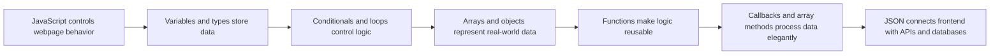
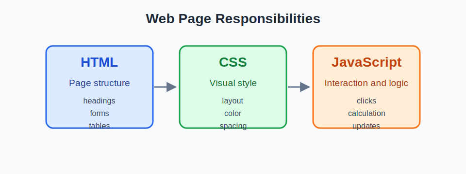
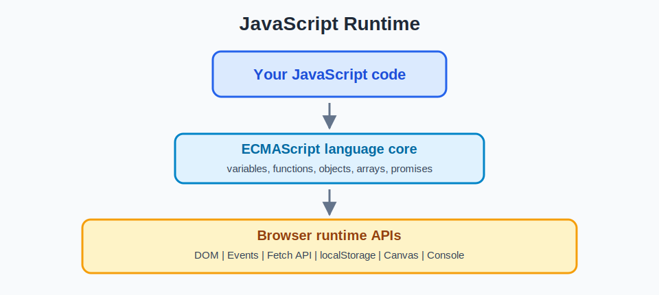
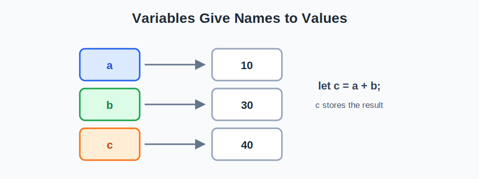
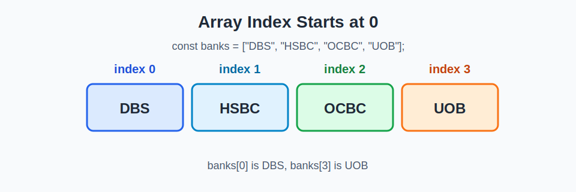
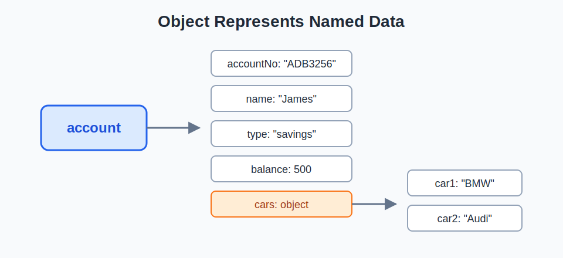
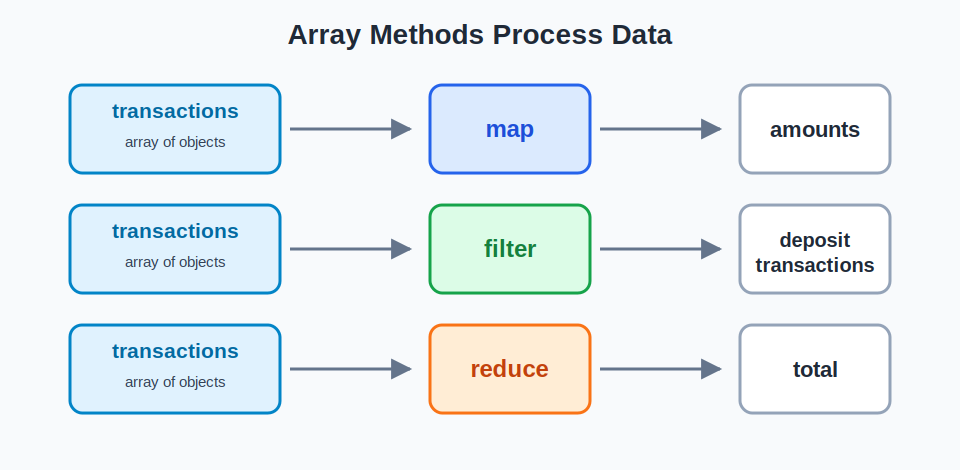

# Lecture 6: JavaScript Fundamentals for Interactive Web Applications

*From static HTML pages to interactive, data-driven web applications.*

This lecture is not only an introduction to JavaScript syntax. It builds a practical learning path for web applications: JavaScript controls webpage behavior, variables and types store data, conditionals and loops control logic, arrays and objects represent real-world data, functions make logic reusable, callbacks and array methods process data elegantly, and JSON connects frontend pages with APIs and databases.

!!! note "How to use this page"
    Read the page once for the overall picture. Then run the code examples, complete the mini demos, and answer the practice questions. Do not only look at the syntax. For each example, ask: What problem does this code solve in webpage interaction, data processing, or a FinTech demo?

!!! tip "How to learn JavaScript in this lecture"
    Do not read JavaScript like reading a textbook only. For each important code block: predict the output first, run the code in the browser console, modify one value, run it again, and explain why the output changed.

## Mental Model for This Lecture



## 0. Learning Objectives

By the end of this lecture, you should be able to:

- Explain the role of JavaScript in web applications.
- Distinguish JavaScript, ECMAScript, and Browser APIs.
- Declare variables with `let` and `const`, and explain why modern JavaScript should not default to `var`.
- Distinguish primitive types and reference types.
- Use `if`, `else if`, `switch`, `for`, and `while` to control program flow.
- Use arrays and objects to represent structured business data.
- Write and call functions, and explain input parameters, function bodies, and return values.
- Understand callbacks, anonymous functions, and arrow functions.
- Use `map`, `filter`, and `reduce` to process arrays of objects.
- Use JSON to transfer data between frontend pages, APIs, and databases.
- Complete a small interactive webpage demo.

!!! tip "Keep the Web App goal in mind"
    The syntax in this lecture is not isolated knowledge. When you later build React pages, call Flask APIs, and display dashboard data, you will repeatedly use variables, objects, arrays, functions, callbacks, array methods, and JSON.

## 1. Why JavaScript?

An HTML page is mostly static by default. It can display headings, paragraphs, tables, and forms. However, when a user clicks a button, enters an amount, submits a form, filters transaction records, or changes a chart, the page needs JavaScript to respond.



*Figure 1. HTML provides structure, CSS controls presentation, and JavaScript adds behavior.*

Read the figure as a simple mental model: HTML gives the page structure, CSS controls how it looks, and JavaScript controls what happens when the user interacts with it.

A simple FinTech example:

```text
User enters principal, rate, and years
-> JavaScript validates the input
-> JavaScript calculates compound interest
-> JavaScript updates the webpage
```

In other words, JavaScript turns a page from "content display" into "user response and data processing."

In this first example, you do not need to fully understand the DOM yet. Just notice the pattern:

1. Read input from the page.
2. Convert input into a useful data type.
3. Calculate a result.
4. Write the result back to the page.

```html
<input id="amount" placeholder="Enter amount">
<button onclick="calculate()">Calculate</button>
<p id="result"></p>

<script>
function calculate() {
  const amount = Number(document.getElementById("amount").value);
  const interest = amount * 0.035;
  document.getElementById("result").textContent =
    `Estimated interest: $${interest.toFixed(2)}`;
}
</script>
```

!!! example "What JavaScript does here"
    `document.getElementById("amount").value` reads the user input. `Number(...)` converts the string input into a number. The function calculates the result and writes it back into `<p id="result">`. This is a minimal version of webpage interaction.

!!! note "Minimal demo"
    This first demo is intentionally minimal. Later, the mini project will add input validation to handle empty input, non-numeric input, and invalid values.

## 2. JavaScript, ECMAScript, and Browser APIs

Beginners often mix several related concepts. Keep these distinctions clear:

| Term | Meaning | Example |
| --- | --- | --- |
| JavaScript | The language developers write | `const x = 10;` |
| ECMAScript | The official language specification | variables, functions, objects, arrays |
| Browser APIs | Capabilities provided by the browser for JavaScript | DOM, events, `fetch`, `localStorage`, canvas |

ECMAScript defines the language core, such as variables, functions, objects, arrays, and promises. Browsers provide the DOM, events, network requests, and other APIs. Node.js, Deno, and Bun can also run JavaScript, but they provide different runtime environments.



*Figure 2. JavaScript code uses the ECMAScript language core and browser runtime APIs.*

The runtime figure separates two ideas. ECMAScript is the language core that every JavaScript developer learns. Browser APIs are extra capabilities supplied by the browser, such as reading elements from the page, listening for clicks, and sending network requests.

!!! note "Current standard note"
    According to the official [ECMA-262](https://ecma-international.org/publications-and-standards/standards/ecma-262/) page, the current published version is ECMAScript 2025, 16th edition, June 2025. The latest drafts are maintained by [TC39](https://tc39.es/ecma262/). This course does not require students to chase the newest proposals. Focus on stable modern JavaScript: `let`, `const`, template literals, arrow functions, array methods, JSON, and DOM/API usage.

!!! warning "JavaScript is not Java"
    JavaScript and Java have similar names, but they are not the same language. They share some surface-level syntax, but their design goals, runtimes, and ecosystems are different.

## 3. First JavaScript Program

The first step is to run JavaScript code. You can do this in three common ways.

### 3.1 Browser Console

Open Developer Tools in your browser, then go to the Console:

```javascript
console.log("Hello JavaScript");
```

Expected output:

```text
Hello JavaScript
```

### 3.2 HTML File with `<script>`

Save the following content as an `.html` file, open it in a browser, and check the Console.

```html
<!DOCTYPE html>
<html>
<body>
  <h1>Hello JavaScript</h1>

  <script>
    console.log("This runs in the browser");
  </script>
</body>
</html>
```

Expected output:

```text
This runs in the browser
```

### 3.3 Online Playground

Lecture 6 is about Web and JavaScript, so Google Colab is not required. You can use CodePen, JSFiddle, StackBlitz, a browser console, or a local HTML file.

!!! tip "Use the browser console"
    If you are not sure what a line of JavaScript prints, paste it into the browser console and run it.

## 4. Variables and Memory

A variable gives a name to a value. Later code can use the name to read or update the value.

```javascript
let a = 10;
let b = 30;
let c = a + b;

console.log(c);
```

Expected output:

```text
40
```



*Figure 3. Variables give names to values, and later expressions can use those names.*

In modern JavaScript, use `const` and `let` by default:

```javascript
let balance = 5000;
balance = balance + 1000;

const bankName = "DBS";
// bankName = "OCBC"; // Error
```

| Keyword | Scope | Reassignment | Modern recommendation |
| --- | --- | --- | --- |
| `let` | block scope | yes | changing values |
| `const` | block scope | no | fixed references |
| `var` | function/global scope | yes | avoid in modern JS |

!!! warning "Do not default to var"
    `var` is a historical keyword, but its scope behavior can confuse beginners. In modern JavaScript courses and projects, use `const` first. Use `let` only when reassignment is needed.

`const` prevents reassignment of the variable name. It does not make an object or array deeply immutable.

```javascript
const account = {
  balance: 500
};

account.balance = 800; // allowed

// account = { balance: 1000 }; // not allowed
```

Here is one concrete reason. `var` ignores block scope:

```javascript
if (true) {
  var x = 10;
}

console.log(x); // 10
```

By contrast, `let` respects block scope:

```javascript
if (true) {
  let y = 10;
}

console.log(y); // ReferenceError
```

!!! note "Block scope"
    A block is usually the code inside `{ ... }`. `let` and `const` stay inside the block where they are declared. This helps prevent accidental variable leaks.

## 5. Primitive Data Types

Primitive types are the most basic data types in JavaScript. They usually represent a single value.

```javascript
let amount = 1000;                   // number
let bank = "DBS";                    // string
let isActive = true;                 // boolean
let middleName = null;               // intentionally empty
let score;                           // undefined
let bigNumber = 9007199254740993n;   // bigint
```

| Type | Example | Meaning |
| --- | --- | --- |
| `number` | `1000`, `3.14` | numeric value |
| `string` | `"DBS"` | text |
| `boolean` | `true`, `false` | logical value |
| `null` | `null` | intentionally empty |
| `undefined` | declared but not assigned | no value assigned yet |
| `bigint` | `9007199254740993n` | very large integer |

When debugging, `typeof` helps you check the type of a value:

```javascript
console.log(typeof 1000);       // number
console.log(typeof "DBS");      // string
console.log(typeof true);       // boolean
console.log(typeof undefined);  // undefined
console.log(typeof null);       // object
```

!!! warning "`typeof null` is strange"
    `typeof null` returns `"object"`. This is a historical JavaScript bug that has been kept for compatibility. In practice, remember that `null` means an intentionally empty value.

!!! example "Predict the output"
    What will this print?

```javascript
let a;
let b = null;

console.log(a);
console.log(b);
```

Expected output:

```text
undefined
null
```

## 6. Strings and Template Literals

A string is text data. Traditional JavaScript can combine strings with `+`:

```javascript
let name = "Jack";
let balance = 7000;

console.log("Hello " + name + ", your balance is $" + balance);
```

Modern JavaScript often uses template literals:

```javascript
let name = "Jack";
let balance = 7000;

console.log(`Hello ${name}, your balance is $${balance}`);
```

Expected output:

```text
Hello Jack, your balance is $7000
```

Template literals are especially useful in web projects because pages often need dynamic text.

```javascript
const user = "Flora";
const score = 86;

const message = `${user} scored ${score} points.`;
console.log(message);
```

## 7. Operators and Equality

JavaScript has arithmetic operators, comparison operators, and logical operators.

```javascript
console.log(10 + 5);
console.log(10 > 5);
console.log(true && false);
```

One common beginner mistake is confusing `==` and `===`:

```javascript
console.log(9 == "9");   // true
console.log(9 === "9");  // false
```

`==` tries type conversion before comparison. `===` compares both value and type.

!!! tip "Class rule"
    In modern JavaScript, prefer `===` and `!==`. Unless you have a very specific reason to allow type conversion, avoid `==`.

!!! warning "Loose equality can surprise you"
    The following example shows why `==` can create bugs.

```javascript
console.log(false == 0);   // true
console.log(false === 0);  // false
```

This matters in web forms. Values read from HTML input elements are usually strings:

```javascript
const input = document.getElementById("amount").value;
console.log(typeof input); // string
```

If you want to calculate with input values, convert them first:

```javascript
const amount = Number(document.getElementById("amount").value);
```

## 8. Control Flow: `if`, `else if`, `switch`

Control flow determines which path a program follows. In finance, interest tiers, credit score bands, and risk levels all need conditional logic.

### 8.1 `if`

```javascript
const amount = 12000;

if (amount > 10000) {
  console.log("Premium interest rate");
}
```

### 8.2 `if...else`

```javascript
const amount = 8000;
let rate;

if (amount > 10000) {
  rate = 0.04;
} else {
  rate = 0.035;
}

console.log(rate);
```

Expected output:

```text
0.035
```

### 8.3 `else if`

```javascript
const creditScore = 720;

if (creditScore >= 750) {
  console.log("Excellent");
} else if (creditScore >= 650) {
  console.log("Good");
} else {
  console.log("Needs review");
}
```

### 8.4 `switch`

```javascript
const weather = "rain";

switch (weather) {
  case "sunny":
    console.log("Go to the beach");
    break;
  case "rain":
    console.log("Stay home");
    break;
  default:
    console.log("Unknown weather");
}
```

!!! warning "Remember break"
    If `break` is missing, JavaScript may continue to execute the following cases. This is called fall-through.

```javascript
const level = "silver";

switch (level) {
  case "silver":
    console.log("Silver benefits");
  case "gold":
    console.log("Gold benefits");
  default:
    console.log("Basic benefits");
}
```

Expected output:

```text
Silver benefits
Gold benefits
Basic benefits
```

## 9. Loops: Repeated Execution

A loop repeats the same logic. For example, you may process all bank names, all transactions, or all customer accounts.

### 9.1 `while`

```javascript
let i = 0;

while (i < 5) {
  console.log(i);
  i++;
}
```

### 9.2 `for`

```javascript
for (let i = 0; i < 5; i++) {
  console.log(i);
}
```

### 9.3 Loop over an Array

```javascript
const banks = ["DBS", "HSBC", "OCBC", "UOB"];

for (let i = 0; i < banks.length; i++) {
  console.log(banks[i]);
}
```



*Figure 4. JavaScript arrays use zero-based indexing, so the first item is at index 0.*

The figure shows why the first item is `banks[0]`, not `banks[1]`. JavaScript arrays use zero-based indexing.

### 9.4 `for...of`

Modern JavaScript also provides `for...of`, which is useful when you only need each item and do not need the index.

```javascript
const banks = ["DBS", "HSBC", "OCBC", "UOB"];

for (const bank of banks) {
  console.log(bank);
}
```

| Loop style | Use when |
| --- | --- |
| Traditional `for` | You need the index or precise control over the loop |
| `for...of` | You only need each item |
| `forEach`, `map`, `filter`, `reduce` | You want a more functional data-processing style |

!!! example "Debugging nested loops"
    In the following code, the inner loop condition uses `i < 3`. This is likely wrong because the inner loop variable is `j`.

```javascript
// Problematic version
for (let i = 0; i < 10; i++) {
  for (let j = 0; i < 3; j++) {
    console.log(j);
  }
}
```

Corrected version:

```javascript
for (let i = 0; i < 10; i++) {
  for (let j = 0; j < 3; j++) {
    console.log(j);
  }
}
```

## 10. Arrays

An array is useful for representing an ordered list of data.

```javascript
const account = ["ABS Bank", 7000.00, true, "Savings Account"];

console.log(account[0]);
console.log(account[1]);
console.log(account.length);
```

Expected output:

```text
ABS Bank
7000
4
```

The problem is readability. `account[0]`, `account[1]`, and `account[2]` do not clearly explain what the values mean. The reader must remember what each position represents.

When data has clear field names, an object is better.

```javascript
const account = {
  bank: "ABS Bank",
  balance: 7000.00,
  hasTransactionToday: true,
  type: "Savings Account"
};

console.log(account.bank);
console.log(account.balance);
```

!!! tip "Array vs object"
    Use an array for an ordered list, such as many transaction records. Use an object for named structured data, such as one account, one customer, or one transaction.

## 11. Objects

An object uses key-value pairs to represent structured data.

```javascript
const account = {
  accountNo: "ADB3256",
  name: "James",
  type: "savings",
  balance: 500
};

console.log(account.accountNo);
console.log(account.balance);
```

Use `accountNo`, not the misspelled `acountNo`.

Objects can also contain nested objects:

```javascript
const account = {
  accountNo: "ADB3256",
  name: "James",
  cars: {
    car1: "BMW",
    car2: "Audi"
  },
  type: "savings",
  balance: 500
};

console.log(account.cars.car1);
```



*Figure 5. A nested object can store related data inside another object.*

The object tree shows that `account.cars.car1` first enters the `cars` object, then reads the `car1` property.

### 11.1 Dot Notation and Bracket Notation

Most of the time, dot notation is easiest to read:

```javascript
console.log(account.accountNo);
console.log(account.balance);
```

Bracket notation is useful when the property name is stored in a variable:

```javascript
console.log(account["accountNo"]);

const field = "balance";
console.log(account[field]);
```

This becomes useful when building dynamic tables or reading fields from API responses.

!!! note "Reference types"
    Arrays and objects are reference types. They can contain multiple values, and they can be passed into or modified by functions. This becomes important when you later work with React state or API responses.

## 12. Array of Objects

In real web applications, data is often an array of objects. For example, transaction records may look like this:

```javascript
const transactions = [
  { id: 1, type: "deposit", amount: 1000 },
  { id: 2, type: "withdrawal", amount: 300 },
  { id: 3, type: "deposit", amount: 500 }
];

for (let i = 0; i < transactions.length; i++) {
  console.log(transactions[i].amount);
}
```

This is probably the most important data shape in this lecture.

An array of objects is one of the most common data shapes between frontend pages, APIs, and databases. A backend API often returns an array of objects. A frontend table often displays an array of objects. A chart often visualizes values extracted from an array of objects.

| id | type | amount |
| -: | --- | ---: |
| 1 | deposit | 1000 |
| 2 | withdrawal | 300 |
| 3 | deposit | 500 |

```javascript
const deposits = transactions.filter(tx => tx.type === "deposit");
const amounts = transactions.map(tx => tx.amount);
const total = transactions.reduce((sum, tx) => sum + tx.amount, 0);

console.log(deposits);
console.log(amounts);
console.log(total);
```

!!! example "FinTech mental model"
    One transaction is an object. Many transactions form an array of objects. When you filter, summarize, or visualize transactions, you will often use `filter`, `map`, and `reduce`.

## 13. Functions

A function packages a piece of logic so it can be reused.

```javascript
function calcInterest(amount) {
  if (amount <= 10000) {
    return amount * 0.03;
  }

  const baseInterest = 10000 * 0.03;
  const extraInterest = (amount - 10000) * 0.035;

  return baseInterest + extraInterest;
}

const result = calcInterest(20000);
console.log(result);
```

Expected output:

```text
650
```

The first $10,000 earns 3%, and the remaining $10,000 earns 3.5%, so the result is `300 + 350 = 650`.

A function can be understood in three parts:

```text
input parameters -> function body -> return value
```

!!! warning "Avoid undefined variables"
    If a function contains `return int;` but `int` was never defined, the code will fail. A function should return a value that has been clearly defined and calculated, such as `return interest;`.

### 13.1 Local Variables

Variables declared inside a function are local to that function. They cannot be accessed outside the function.

```javascript
function calcSimpleInterest(amount) {
  const rate = 0.03;
  return amount * rate;
}

console.log(calcSimpleInterest(1000)); // 30
console.log(rate); // ReferenceError
```

This idea matters later when you work with callbacks, event handlers, and React components.

## 14. Function Expressions and Arrow Functions

In JavaScript, a function can also be assigned to a variable like a value.

```javascript
const futureValue = function(principal, rate, years, compoundTimes) {
  rate = rate / 100;
  return principal * (1 + rate / compoundTimes) ** (compoundTimes * years);
};

console.log(futureValue(1000, 5, 3, 1));
```

Arrow functions are common in modern JavaScript:

```javascript
const futureValueArrow = (principal, rate, years, compoundTimes) => {
  rate = rate / 100;
  return principal * (1 + rate / compoundTimes) ** (compoundTimes * years);
};

const double = x => x * 2;
```

!!! tip "Where arrow functions appear"
    Arrow functions are widely used with array methods, callbacks, React components, event handlers, and API handling.

## 15. Callback Functions

A callback function is a function passed into another function so it can be called later.

Traditional `for` loop:

```javascript
const banks = ["DBS", "HSBC", "OCBC", "UOB"];

for (let i = 0; i < banks.length; i++) {
  console.log(banks[i]);
}
```

Using `forEach` with an anonymous function:

```javascript
banks.forEach(function(bank, index) {
  console.log(`${bank} is at index ${index}`);
});
```

Using an arrow function:

```javascript
banks.forEach((bank, index) => {
  console.log(`${bank} is at index ${index}`);
});
```

```text
forEach receives a function
-> forEach visits each item
-> forEach calls your function for each item
```

!!! note "Why callbacks matter"
    Browser events also use callback thinking. You tell the browser: "When this button is clicked, call this function." This idea will appear again in DOM events and React.

Here is the same idea in a webpage event:

```html
<button id="helloButton">Say Hello</button>

<script>
  const button = document.getElementById("helloButton");

  button.addEventListener("click", function() {
    console.log("Button clicked");
  });
</script>
```

The function is not called immediately. It is called later when the user clicks the button. That is why it is a callback.

## 16. `map`, `filter`, `reduce`

`map`, `filter`, and `reduce` are bridges from basic JavaScript syntax to real data processing.



*Figure 6. `map`, `filter`, and `reduce` represent three common data-processing intentions.*

The flow diagram shows three common intentions: transform each record with `map`, keep selected records with `filter`, and combine many records into one result with `reduce`.

Use the same transaction array:

```javascript
const transactions = [
  { id: 1, type: "deposit", amount: 1000 },
  { id: 2, type: "withdrawal", amount: 300 },
  { id: 3, type: "deposit", amount: 500 }
];
```

### 16.1 `map`: transform each item

```javascript
const amounts = transactions.map(tx => tx.amount);
console.log(amounts);
```

Expected output:

```text
[1000, 300, 500]
```

### 16.2 `filter`: keep selected items

```javascript
const deposits = transactions.filter(tx => tx.type === "deposit");
console.log(deposits);
```

Expected output:

```text
[
  { id: 1, type: "deposit", amount: 1000 },
  { id: 3, type: "deposit", amount: 500 }
]
```

### 16.3 `reduce`: combine many values into one

```javascript
const total = transactions.reduce((sum, tx) => {
  return sum + tx.amount;
}, 0);

console.log(total);
```

Expected output:

```text
1800
```

| Method | Purpose | Returns |
| --- | --- | --- |
| `forEach` | do something for each item | `undefined` |
| `map` | transform each item | new array |
| `filter` | select some items | new array |
| `reduce` | combine items | single value |

!!! tip "Focus on meaning"
    For beginners, do not start by asking which method is faster. Start with the meaning: `map` transforms, `filter` selects, and `reduce` summarizes.

!!! warning "Do not overuse reduce"
    `reduce` is powerful, but it can be harder to read for beginners. If a `for` loop is clearer, it is acceptable to use a `for` loop first. Use `reduce` when the idea is clearly "combine many values into one."

## 17. String Methods

String methods are useful for cleaning user input, processing form text, and formatting API data.

```javascript
const message = "I'm feeling great.";

console.log(message.length);
console.log(message.slice(4, 11));
console.log(message.indexOf("feel"));
console.log(message.replace("feel", "doing"));
console.log(message.toLowerCase());
console.log(message.toUpperCase());
```

Expected output:

```text
18
feeling
4
I'm doinging great.
i'm feeling great.
I'M FEELING GREAT.
```

The output `I'm doinging great.` looks strange on purpose. `replace("feel", "doing")` only replaces the matched substring. It does not understand the meaning of the word "feeling." If you want the natural sentence, use `replace("feeling", "doing")`.

You can also verify that the original string does not change:

```javascript
const message = "I'm feeling great.";
const newMessage = message.replace("feeling", "doing");

console.log(message);    // I'm feeling great.
console.log(newMessage); // I'm doing great.
```

!!! warning "Strings are immutable"
    Methods like `replace` return a new string. They do not change the original string unless you assign the result to a variable.

## 18. JSON

JSON is a common format for transferring data in web applications. Data received from an API is often a JSON string, while JavaScript programs usually work with JavaScript objects.

JavaScript object:

```javascript
const user = { name: "John", age: 30 };
```

JSON string:

```javascript
const jsonString = '{"name":"John","age":30}';
```

JSON is stricter than JavaScript object syntax:

```javascript
// JavaScript object
const user = { name: "John", age: 30 };

// Valid JSON string
const json = '{"name":"John","age":30}';

// Invalid JSON string
const invalidJson = "{name:'John', age:30}";
```

!!! warning "JSON uses double quotes"
    In JSON, keys must use double quotes. String values must also use double quotes. Single quotes are not valid JSON.

Two important methods:

```javascript
const user = {
  name: "John",
  age: 30,
  car: null
};

const jsonString = JSON.stringify(user);
console.log(jsonString);

const parsedUser = JSON.parse(jsonString);
console.log(parsedUser.name);
```

Expected output:

```text
{"name":"John","age":30,"car":null}
John
```

```text
JSON.parse      JSON string -> JavaScript object
JSON.stringify JavaScript object -> JSON string
```

!!! example "Preview of later API responses"
    Later in the course, API responses will often look like this.

```json
[
  { "symbol": "DBS", "price": 45.20 },
  { "symbol": "UOB", "price": 37.80 }
]
```

## 19. Mini Project Demos

Each demo below can be saved as an `.html` file and opened in a browser. No backend server is required.

### 19.1 Demo 1: Compound Interest Calculator

Goal: practice variables, functions, DOM access, and template literals.

```html
<!DOCTYPE html>
<html>
<body>
  <h1>Compound Interest Calculator</h1>

  <label>Principal</label>
  <input id="principal" value="1000">

  <label>Annual rate (%)</label>
  <input id="rate" value="5">

  <label>Years</label>
  <input id="years" value="3">

  <button onclick="calculateFutureValue()">Calculate</button>
  <p id="result"></p>

  <script>
    function calculateFutureValue() {
      const principal = Number(document.getElementById("principal").value);
      const rate = Number(document.getElementById("rate").value) / 100;
      const years = Number(document.getElementById("years").value);

      if (Number.isNaN(principal) || Number.isNaN(rate) || Number.isNaN(years)) {
        document.getElementById("result").textContent =
          "Please enter valid numbers.";
        return;
      }

      if (principal <= 0 || rate < 0 || years <= 0) {
        document.getElementById("result").textContent =
          "Please enter positive values.";
        return;
      }

      const value = principal * (1 + rate) ** years;

      document.getElementById("result").textContent =
        `Future value: $${value.toFixed(2)}`;
    }
  </script>
</body>
</html>
```

Expected output after clicking the button:

```text
Future value: $1157.63
```

If the user enters invalid text, the page should show:

```text
Please enter valid numbers.
```

If the user enters a negative principal or zero years, the page should show:

```text
Please enter positive values.
```

### 19.2 Demo 2: Transaction Analyzer

Goal: practice arrays of objects, `filter`, `map`, and `reduce`.

```html
<!DOCTYPE html>
<html>
<body>
  <h1>Transaction Analyzer</h1>
  <button onclick="analyze()">Analyze</button>
  <pre id="result"></pre>

  <script>
    const transactions = [
      { type: "deposit", amount: 1000 },
      { type: "withdrawal", amount: 300 },
      { type: "deposit", amount: 500 },
      { type: "withdrawal", amount: 200 }
    ];

    function analyze() {
      const deposits = transactions.filter(tx => tx.type === "deposit");
      const depositAmounts = deposits.map(tx => tx.amount);
      const totalDeposit = depositAmounts.reduce((sum, amount) => {
        return sum + amount;
      }, 0);

      document.getElementById("result").textContent =
        `Deposit count: ${deposits.length}\nTotal deposit: $${totalDeposit}`;
    }
  </script>
</body>
</html>
```

Expected output after clicking the button:

```text
Deposit count: 2
Total deposit: $1500
```

### 19.3 Demo 3: JSON API Simulation

Goal: understand how `JSON.parse` and `JSON.stringify` connect the frontend and APIs.

```html
<!DOCTYPE html>
<html>
<body>
  <h1>JSON API Simulation</h1>
  <button onclick="loadPrices()">Load Prices</button>
  <pre id="result"></pre>

  <script>
    const apiResponse = `
    [
      { "symbol": "DBS", "price": 45.2 },
      { "symbol": "UOB", "price": 37.8 }
    ]
    `;

    function loadPrices() {
      const stocks = JSON.parse(apiResponse);
      const lines = stocks.map(stock => {
        return `${stock.symbol}: $${stock.price}`;
      });

      const newRequestBody = JSON.stringify({
        selectedSymbol: stocks[0].symbol
      });

      document.getElementById("result").textContent =
        lines.join("\n") + "\n\nRequest body: " + newRequestBody;
    }
  </script>
</body>
</html>
```

Expected output after clicking the button:

```text
DBS: $45.2
UOB: $37.8

Request body: {"selectedSymbol":"DBS"}
```

!!! warning "These demos are learning examples"
    Real projects also need input validation, error handling, styling, accessibility, security checks, and API error handling. This lecture focuses on basic JavaScript logic first.

## 20. Practice Questions

### 20.1 Basic Choice and Judgment

1. In a webpage, which layer usually controls user interaction: HTML, CSS, or JavaScript?
2. True or false: `const` means the variable name cannot be reassigned.
3. True or false: `9 == "9"` and `9 === "9"` always return the same result.
4. Which data structure is better for one bank account with named fields: array or object?
5. Which array method is best for selecting only withdrawal transactions: `map`, `filter`, or `reduce`?

??? example "Answer key"
    1. JavaScript controls user interaction.
    2. True. The variable name cannot be reassigned, although objects and arrays referenced by `const` can still have their contents modified.
    3. False. `9 == "9"` is `true`, but `9 === "9"` is `false`.
    4. Object.
    5. `filter`.

### 20.2 Predict the Output

```javascript
const balance = 1000;
const fee = "20";

console.log(balance + fee);
console.log(balance + Number(fee));
```

??? example "Answer"
    ```text
    100020
    1020
    ```

    The first line performs string concatenation because `fee` is a string. The second line performs numeric addition because `Number(fee)` converts it to a number.

```javascript
const banks = ["DBS", "HSBC", "OCBC"];

for (let i = 0; i < banks.length; i++) {
  console.log(`${i}: ${banks[i]}`);
}
```

??? example "Answer"
    ```text
    0: DBS
    1: HSBC
    2: OCBC
    ```

```javascript
const transactions = [
  { type: "deposit", amount: 100 },
  { type: "withdrawal", amount: 40 },
  { type: "deposit", amount: 60 }
];

const totalDeposit = transactions
  .filter(tx => tx.type === "deposit")
  .reduce((sum, tx) => sum + tx.amount, 0);

console.log(totalDeposit);
```

??? example "Answer"
    ```text
    160
    ```

### 20.3 Debugging Questions

Find and fix the issues.

```javascript
const account = {
  acountNo: "ADB3256",
  balance: 500
};

console.log(account.accountNo);
```

??? example "Fixed version"
    ```javascript
    const account = {
      accountNo: "ADB3256",
      balance: 500
    };

    console.log(account.accountNo);
    ```

```javascript
for (let i = 0; i < 10; i++) {
  for (let j = 0; i < 3; j++) {
    console.log(j);
  }
}
```

??? example "Fixed version"
    ```javascript
    for (let i = 0; i < 10; i++) {
      for (let j = 0; j < 3; j++) {
        console.log(j);
      }
    }
    ```

```javascript
function calcInterest(amount) {
  let interest = amount * 0.03;
  return int;
}

console.log(calcInterest(1000));
```

??? example "Fixed version"
    ```javascript
    function calcInterest(amount) {
      const interest = amount * 0.03;
      return interest;
    }

    console.log(calcInterest(1000));
    ```

### 20.4 Mini Project Extension

Choose one extension:

- Add input validation to the compound interest calculator.
- Add withdrawal total and net cash flow to the transaction analyzer.
- Add a simple table that displays the parsed JSON stock prices.
- Add a risk label to each transaction: small, medium, or large.

## 21. Common Beginner Errors

These mistakes are common when students first move from reading JavaScript to writing JavaScript.

### Error 1: Forgetting to Convert Input Strings to Numbers

```javascript
const a = "10";
const b = "20";
console.log(a + b); // "1020"
```

Fix:

```javascript
console.log(Number(a) + Number(b)); // 30
```

### Error 2: Using `=` Instead of `===`

```javascript
let type = "withdrawal";

if (type = "deposit") {
  console.log("Deposit");
}
```

This assigns `"deposit"` to `type`. It does not compare values.

Fix:

```javascript
if (type === "deposit") {
  console.log("Deposit");
}
```

### Error 3: Accessing the Wrong Object Property

```javascript
const account = { accountNo: "A001" };
console.log(account.acountNo); // undefined
```

Fix:

```javascript
console.log(account.accountNo);
```

### Error 4: Missing `return`

```javascript
function add(a, b) {
  a + b;
}

console.log(add(1, 2)); // undefined
```

Fix:

```javascript
function add(a, b) {
  return a + b;
}
```

### Error 5: Parsing Invalid JSON

```javascript
JSON.parse("{name:'John'}"); // Error
```

Fix:

```javascript
JSON.parse('{"name":"John"}');
```

!!! tip "Debugging habit"
    When something looks wrong, check the type, check the spelling of property names, and print intermediate values with `console.log`.

!!! note "Semicolons"
    JavaScript often works without semicolons because of automatic semicolon insertion. In this course, using semicolons consistently is acceptable and can make examples clearer.

## 22. Final Mini Task: Simple Expense Dashboard

Build a small webpage that uses the ideas from this lecture.

Requirements:

1. Store at least five transactions as an array of objects.
2. Show all transactions in a table.
3. Calculate total income, total expense, and net balance.
4. Use `filter` to separate income and expense.
5. Use `reduce` to calculate totals.
6. Use template literals to display summary text.
7. Add a button that recalculates the summary when clicked.

Starter data:

```javascript
const transactions = [
  { id: 1, type: "income", amount: 1200, note: "Salary" },
  { id: 2, type: "expense", amount: 200, note: "Food" },
  { id: 3, type: "expense", amount: 80, note: "Transport" },
  { id: 4, type: "income", amount: 300, note: "Freelance" },
  { id: 5, type: "expense", amount: 150, note: "Books" }
];
```

Expected summary:

```text
Total income: $1500
Total expense: $430
Net balance: $1070
```

Suggested HTML skeleton:

```html
<h1>Simple Expense Dashboard</h1>

<button onclick="calculateSummary()">Calculate Summary</button>

<table id="transactionTable"></table>

<pre id="summary"></pre>
```

Suggested JavaScript skeleton:

```javascript
function renderTable() {
  // 1. Select the transactionTable element.
  // 2. Build table rows from the transactions array.
  // 3. Write the table HTML back to the page.
}

function calculateSummary() {
  // 1. Filter income transactions.
  // 2. Filter expense transactions.
  // 3. Use reduce to calculate totals.
  // 4. Update the summary element.
}
```

!!! question "Reflection"
    How would this mini dashboard change if the transaction data came from a backend API instead of being written directly inside the JavaScript file?

## 23. Final Review Checklist

Use this checklist before moving to later Web App topics:

- Can I explain what JavaScript adds to an HTML page?
- Can I use `let` and `const` correctly?
- Can I explain `null` vs `undefined`?
- Can I explain why `===` is usually safer than `==`?
- Can I loop through an array and access each item?
- Can I represent a transaction as an object?
- Can I represent many transactions as an array of objects?
- Can I write a function with parameters and a return value?
- Can I recognize a callback function?
- Can I use `map`, `filter`, and `reduce` on transaction data?
- Can I convert between JSON strings and JavaScript objects?

## 24. Final Concept Map

```text
Webpage interaction
  -> JavaScript behavior
       -> variables and types
       -> conditionals and loops
       -> arrays and objects
       -> functions and callbacks
       -> map / filter / reduce
       -> JSON for API data
```
